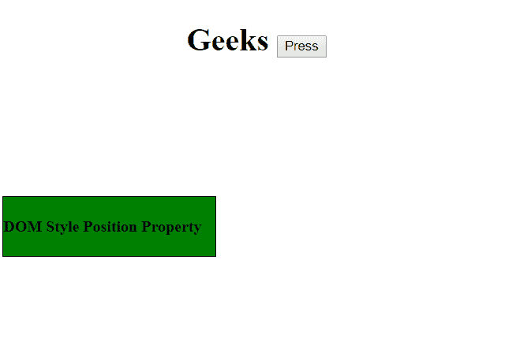
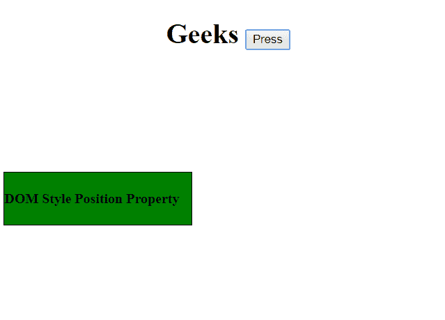
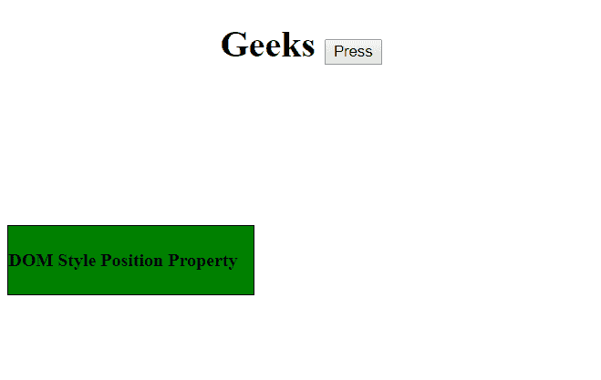
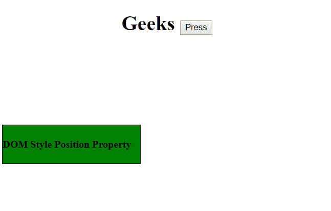
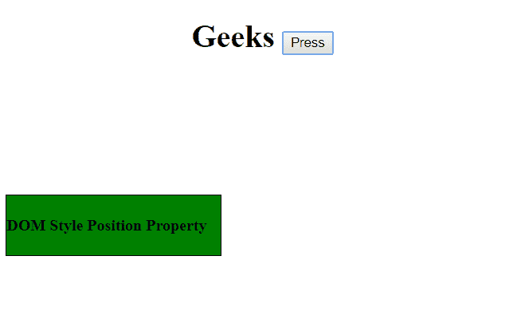
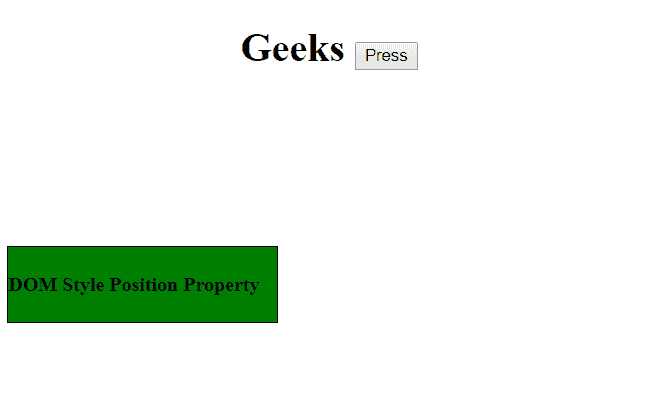
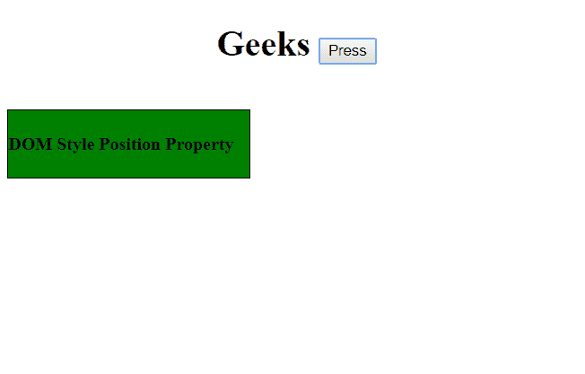
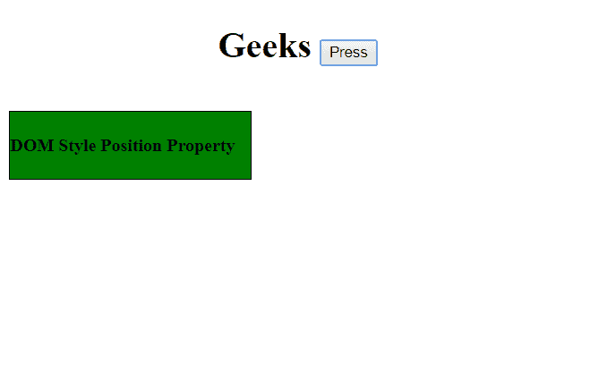
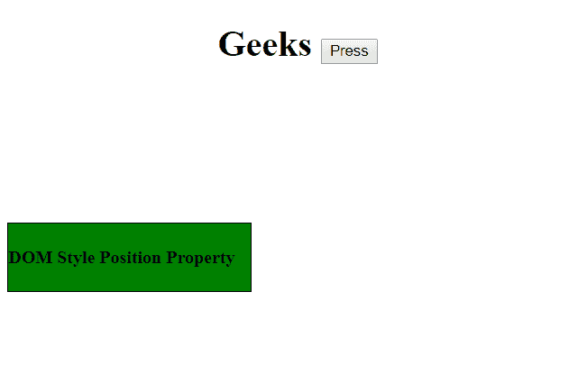
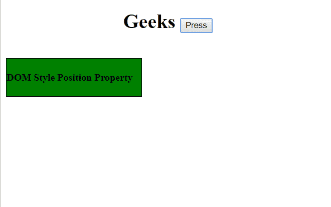

# HTML | DOM 样式位置属性

> 原文: [https://www.geeksforgeeks.org/html-dom-style-position-property/](https://www.geeksforgeeks.org/html-dom-style-position-property/)

**位置属性** *设置*或*返回*元素使用的定位方法类型。它可以是`static`、`relative`、`absolute`或`fixed`。

## 语法

*   返回位置语法:
    ```html
    object.style.position
    ```
*   设置位置语法:
    ```html
    object.style.position = "static | absolute | fixed | relative | sticky | initial | inherit"
    ```

**返回值:** 返回表示元素位置类型的字符串。

## 属性

### static
它是默认属性。元素在文档中的外观根据文档流保持静态。

**示例:**
```html
<!DOCTYPE html>
<html>
<head>
    <h1>
      <center>Geeks
         <button onclick="position()">
          Press
         </button>
      </center>
  </h1>
    <br>
<style>
        #gfg {
            border: 1px solid black;
            background-color: green;
            width: 215px;
            height: 60px;
            position: relative;
            top: 100px;
        }
    </style>
</head>
<body>
<div id="gfg">
<h4>DOM Style Position Property</h4>
</div>
<script>
        function position() {
            //  change position from reletive to static.
            document.getElementById("gfg").style.position = "static";
        }
    </script>
</body>
</html>
```

**输出:**
*   点击按钮前:
    
*   点击按钮后:
    

### absolute
它将元素相对于第一个已定位的祖先元素进行定位。

**示例:**
```html
<!DOCTYPE html>
<html>
<head>
    <h1>
      <center>Geeks
         <button onclick="position()">
          Press
         </button>
      </center>
  </h1>
    <br>
<style>
        #gfg {
            border: 1px solid black;
            background-color: green;
            width: 215px;
            height: 60px;
            position: relative;
            top: 100px;
        }
    </style>
</head>
<body>
<div id="gfg">
        <p>
            <h4>DOM Style Position Property</h4></p>
</div>
<script>
        function position() {
            //  Set position from reletive to absolute.
            document.getElementById("gfg").style.position = "absolute";
        }
    </script>
</body>
</html>
```

**输出:**
*   点击按钮前:
    
*   点击按钮后:
    

### fixed
它将元素相对于浏览器窗口进行定位。

**示例:**
```html
<!DOCTYPE html>
<html>
<head>
    <h1>
     <center>Geeks
         <button onclick="position()">
          Press
         </button>
      </center>
  </h1>
    <br>
<style>
        #gfg {
            border: 1px solid black;
            background-color: green;
            width: 215px;
            height: 60px;
            position: relative;
            top: 100px;
        }
    </style>
</head>
<body>
<div id="gfg">
         <h4>DOM Style Position Property</h4>
    </div>
<script>
        function position() {
            document.getElementById("gfg").style.position = "fixed";
        }
    </script>
</body>
</html>
```

**输出:**
*   点击按钮前:
    
*   点击按钮后:
    

### relative
它将元素相对于其正常位置进行定位，因此`"right:40"`表示在元素的右侧位置增加40像素。

**示例:**
```html
<!DOCTYPE html>
<html>
<head>
    <h1>
    <center>Geeks
         <button onclick="position()">
          Press
         </button>
      </center>
  </h1>
    <br>
```

## 5. sticky
`sticky`属性值根据用户的滚动位置来定位元素。滚动操作在`relative`和`fixed`属性值之间执行。默认情况下，滚动位置设置为`relative`值。

**示例:**

```html
<!DOCTYPE html>
<html>

<head>
    <h1>
    <center>Geeks 
         <button onclick="position()">
          Press
         </button>
      </center> 
    </h1>
    <br>

<style>
        #gfg {
            border: 1px solid black;
            background-color: green;
            width: 215px;
            height: 60px;
            position: relative;
            top: 100px;
        }
    </style>
</head>

<body>

<div id="gfg">
            <h4>DOM Style Position Property</h4>
    </div>

<script>
        function position() {
            document.getElementById(
              "gfg").style.position = "sticky";
        }
    </script>

</body>

</html>
```

**输出:**

*   点击按钮前:
        
*   点击按钮后:
        

**注意:** Internet Explorer 不支持该属性值，Apple Safari 从 6.1 版本开始支持该属性。

## 6. initial
`initial`属性值将`position`设置为其默认值。

**示例:**

```html
<!DOCTYPE html>
<html>

<head>
    <h1>
    <center>Geeks 
         <button onclick="position()">
          Press
         </button>
      </center> 
  </h1>
    <br>

<style>
        #gfg {
            border: 1px solid black;
            background-color: green;
            width: 215px;
            height: 60px;
            position: relative;
            top: 100px;
        }
    </style>
</head>

<body>

<div id="gfg">
       <h4>DOM Style Position Property</h4>

</div>

<script>
        function position() {
            document.getElementById(
              "gfg").style.position = "initial";
        }
    </script>

</body>

</html>
```

**输出:**

*   点击按钮前:
        
*   点击按钮后:
        

## 7. inherit
`inherit`属性值继承父元素的`position`值。

**示例:**

```html
<!DOCTYPE html>
<html>

<head>
    <h1>
    <center>Geeks 
         <button onclick="position()">
          Press
         </button>
      </center> 
  </h1>
    <br>

<style>
        #gfg {
            border: 1px solid black;
            background-color: green;
            width: 215px;
            height: 60px;
            position: relative;
            top: 100px;
        }
    </style>
</head>

<body>

<div id="gfg">
            <h4>DOM Style Position Property</h4>

</div>

<script>
        function position() {
            document.getElementById(
              "gfg").style.position = "inherit";
        }
    </script>

</body>

</html>
```

**输出:**

*   点击按钮前:
        
*   点击按钮后:
        

**浏览器支持:** DOM `position`属性支持的浏览器如下:

*   谷歌 Chrome
*   微软公司出品的 web 浏览器
*   火狐浏览器
*   歌剧
*   旅行队