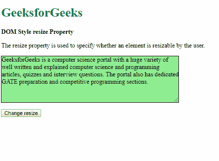
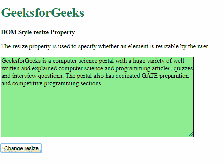
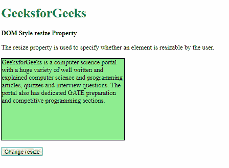
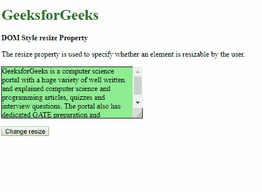
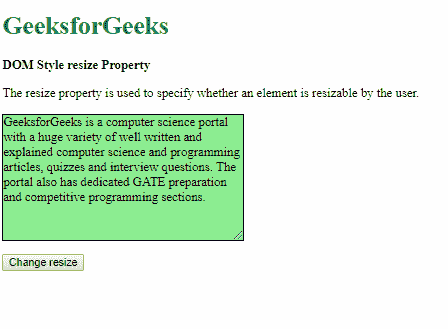
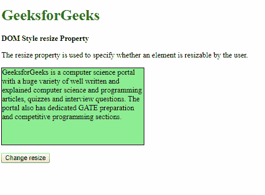
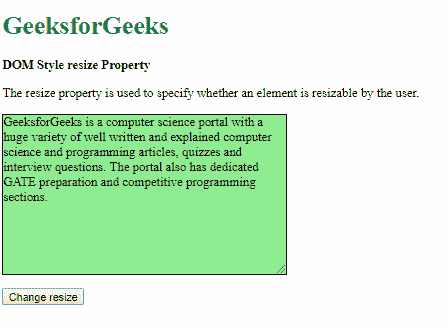
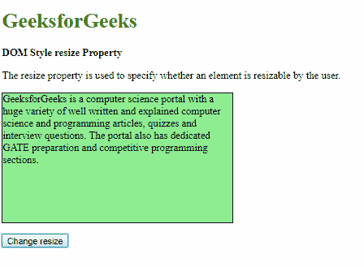
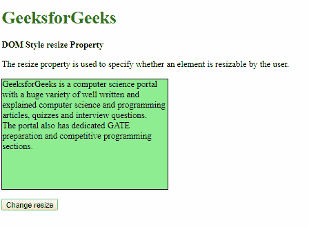
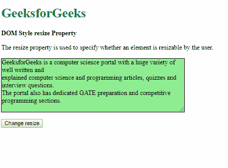

# HTML DOM `style.resize` 属性

> 原文：[https://www.geeksforgeeks.org/html-dom-style-resize-property/](https://www.geeksforgeeks.org/html-dom-style-resize-property/)

HTML DOM 中的 `style.resize` 属性用于指定用户是否可以调整元素的高度和宽度。

## 语法

*   它返回调整大小属性：
    ```html
    object.style.resize
    ```

*   用于设置调整大小属性：
    ```html
    object.style.resize = "both|horizontal|vertical|none|initial|inherit"
    ```

## 属性值

### 1. `both`
此值允许用户同时更改元素的高度和宽度。

**示例-1：**
```html
<!DOCTYPE html>
<html>
<head>
    <title>DOM Style resize Property</title>
    <style>
        .content {
            background-color: lightgreen;
            border: 1px solid;
            height: 200px;
            width: 300px;
            overflow: auto;
        }
    </style>
</head>
<body>
    <h1 style="color: green">GeeksforGeeks</h1>
    <b>DOM Style resize Property</b>
    <p>The resize property is used to specify whether an element is resizable by the user.</p>
    <p class="content">GeeksforGeeks is a computer science portal with a huge variety of well written and explained computer science and programming articles, quizzes and interview questions. The portal also has dedicated GATE preparation and competitive programming sections.</p>
    <button onclick="setResize()">Change resize</button>
    <!-- Script to set resize to both -->
    <script>
        function setResize() {
            elem = document.querySelector('.content');
            elem.style.resize = 'both';
        }
    </script>
</body>
</html>
```

**输出：**
*   点击按钮前：
    
*   点击按钮后：
    

### 2. `horizontal`
此值允许用户仅更改元素的宽度。

**示例-2：**
```html
<!DOCTYPE html>
<html>
<head>
    <title>DOM Style resize Property</title>
    <style>
        .content {
            background-color: lightgreen;
            border: 1px solid;
            height: 200px;
            width: 300px;
            overflow: auto;
        }
    </style>
</head>
<body>
    <h1 style="color: green">GeeksforGeeks</h1>
    <b>DOM Style resize Property</b>
    <p>The resize property is used to specify whether an element is resizable by the user.</p>
    <p class="content">GeeksforGeeks is a computer science portal with a huge variety of well written and explained computer science and programming articles, quizzes and interview questions. The portal also has dedicated GATE preparation and competitive programming sections.</p>
    <button onclick="setResize()">Change resize</button>
    <!-- Script to set resize to horizontal -->
    <script>
        function setResize() {
            elem = document.querySelector('.content');
            elem.style.resize = 'horizontal';
        }
    </script>
</body>
</html>
```

**输出：**
*   点击按钮前：
    
*   点击按钮后：
    

### 3. `vertical`
此值允许用户仅更改元素的高度。

**示例-3：**
```html
<!DOCTYPE html>
<html>
<head>
    <title>DOM Style resize Property</title>
    <style>
        .content {
            background-color: lightgreen;
            border: 1px solid;
            height: 200px;
            width: 300px;
            overflow: auto;
        }
    </style>
</head>
<body>
    <h1 style="color: green">GeeksforGeeks</h1>
    <b>DOM Style resize Property</b>
    <p>The resize property is used to specify whether an element is resizable by the user.</p>
    <p class="content">GeeksforGeeks is a computer science portal with a huge variety of well written and explained computer science and programming articles, quizzes and interview questions. The portal also has dedicated GATE preparation and competitive programming sections.</p>
    <button onclick="setResize()">Change resize</button>
    <!-- Script to set resize to vertical -->
    <script>
        function setResize() {
            elem = document.querySelector('.content');
            elem.style.resize = 'vertical';
        }
    </script>
</body>
</html>
```

**输出：**
*   点击按钮前：
    
*   点击按钮后：
    

### 4. `none`
此值禁止用户更改元素的高度和宽度。

**示例-4：**
```html
<!DOCTYPE html>
<html>
<head>
    <title>DOM Style resize Property</title>
    <style>
        .content {
            background-color: lightgreen;
            border: 1px solid;
            height: 200px;
            width: 300px;
            overflow: auto;
            resize: vertical;
        }
    </style>
</head>
<body>
    <h1 style="color: green">GeeksforGeeks</h1>
    <b>DOM Style resize Property</b>
    <p>The resize property is used to specify whether an element is resizable by the user.</p>
    <p class="content">GeeksforGeeks is a computer science portal with a huge variety of well written and explained computer science and programming articles, quizzes and interview questions. The portal also has dedicated GATE preparation and competitive programming sections.</p>
    <button onclick="setResize()">Change resize</button>
    <!-- Script to set resize to none -->
    <script>
        function setResize() {
            elem = document.querySelector('.content');
            elem.style.resize = 'none';
        }
    </script>
</body>
</html>
```

**输出：**
*   点击按钮前：
    
*   点击按钮后：
    

### 5. `initial`
此值用于将属性设置为其默认值。

**示例-5：**
```html
<!DOCTYPE html>
<html>
<head>
    <title>DOM Style resize Property</title>
    <style>
        .content {
            background-color: lightgreen;
            border: 1px solid;
            height: 200px;
            width: 300px;
            overflow: auto;
            resize: horizontal;
        }
    </style>
</head>
```

# GeeksforGeeks

## DOM Style resize Property

`resize`属性用于指定用户是否可以调整元素的大小。

`GeeksforGeeks`是一个计算机科学门户网站，包含大量撰写精良、解释详尽的计算机科学与编程文章、测验和面试题目。该门户还设有专门的`GATE`备考和竞技编程板块。

<button onclick="setResize()">
  Change resize
</button>

<!-- Script to set resize to initial -->
<script>
    function setResize() {
        elem = document.querySelector('.content');
        elem.style.resize = 'initial';
    }
</script>

**输出:**

*   Before clicking the button:



*   After clicking the button:



## 示例-6

```html
<!DOCTYPE html>
<html>
<head>
    <title>
      DOM Style resize Property
  </title>
    <style>
        #parent {
            resize: both;
        }

        .content {
            background-color: lightgreen;
            border: 1px solid;
            height: 200px;
            width: 300px;
            overflow: auto;
        }
    </style>
</head>
<body>
    <h1 style="color: green">
      GeeksforGeeks
  </h1>
    <b>
      DOM Style resize Property
  </b>
    <p>
        The resize property is used to
      specify whether an element is
      resizable by the user.
    </p>
    <div id="parent">
        <p class="content">
            GeeksforGeeks is a computer science
          portal with a huge variety of well
          written and explained computer science
          and programming articles, quizzes and
          interview questions. The portal also
          has dedicated GATE preparation and 
          competitive programming sections.
        </p>
    </div>
    <button onclick="setResize()">
      Change resize
  </button>

<!-- Script to set resize to inherit -->
    <script>
        function setResize() {
            elem = document.querySelector('.content');
            elem.style.resize = 'inherit';
        }
    </script>
</body>
</html>
```

**输出:**

*   Before clicking the button:



*   After clicking the button:



**支持的浏览器:**由`DOM Style resize`属性支持的浏览器如下:

*   谷歌 Chrome
*   火狐浏览器
*   歌剧
*   苹果 Safari