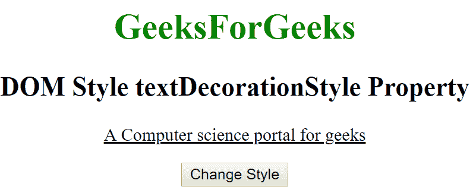
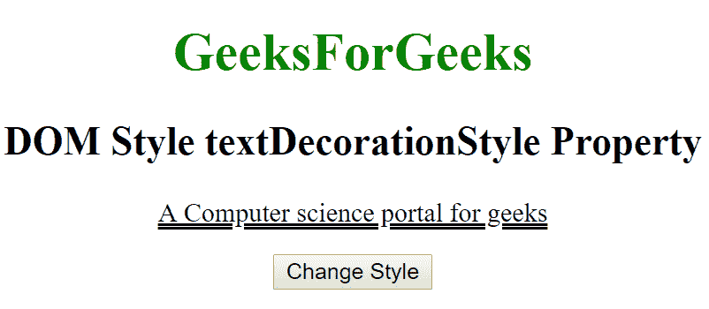
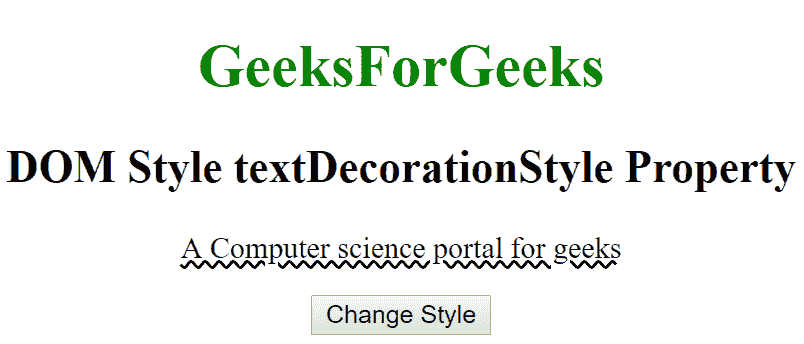

# HTML DOM 样式文本装饰样式属性

> 原文: [https://www.geeksforgeeks.org/html-dom-style-textdecorationstyle-property/](https://www.geeksforgeeks.org/html-dom-style-textdecorationstyle-property/)

HTML DOM 中的 `textDecorationStyle` 属性用于设置线条样式。可以像单线、双线、波浪形等多种样式显示线条。通过使用该属性，我们可以以指定的样式显示线条。

**语法:**

*   它返回 `textDecorationStyle` 属性。

```javascript
object.style.textDecorationStyle
```

*   它用于设置 `textDecorationStyle` 属性。

```javascript
object.style.textDecorationStyle = "solid|double|dotted|dashed|wavy|initial|inherit"
```

**属性值:**

*   `solid`: 该属性用于将直线显示为单线。这是默认值。
*   `double`: 此属性用于将线显示为双线。
*   `dotted`: 该属性用于将线显示为点线。
*   `dashed`: 该属性用于将直线显示为虚线。
*   `wavy`: 该属性用于将线条显示为波浪线。
*   `initial`: 它将 `textDecorationStyle` 属性设置为默认值。
*   `inherit`: 该属性从其父元素继承而来。

**返回值:**

*   它返回一个字符串，该字符串表示元素的 `textDecorationStyle` 属性。

## 示例-1

```html
<!DOCTYPE html>
<html>
<head>
    <title>DOM Style textDecorationStyle Property</title>
    <style>
        #gfg {
            text-decoration: underline;
        }
    </style>
</head>
<body>
    <center>
        <h1 style="color:green;width:40%;">GeeksForGeeks</h1>
        <h2>DOM Style textDecorationStyle Property</h2>
        <p id="gfg">A Computer science portal for geeks</p>
        <button type="button" onclick="geeks()">Change Style</button>
        <script>
            function geeks() {
                // Set textDecorationStyle Property
                document.getElementById("gfg").style.textDecorationStyle = "double";
            }
        </script>
    </center>
</body>
</html>
```

**输出:**

*   点击按钮前:
    
*   点击按钮后:
    

## 示例-2

```html
<!DOCTYPE html>
<html>
<head>
    <title>DOM Style textDecorationStyle Property</title>
    <style>
        #gfg {
            text-decoration: underline;
        }
    </style>
</head>
<body>
    <center>
        <h1 style="color:green;width:40%;">GeeksForGeeks</h1>
        <h2>DOM Style textDecorationStyle Property</h2>
        <p id="gfg">A Computer science portal for geeks</p>
        <button type="button" onclick="geeks()">Change Style</button>
        <script>
            function geeks() {
                // Set textDecorationStyle Property
                document.getElementById("gfg").style.textDecorationStyle = "wavy";
            }
        </script>
    </center>
</body>
</html>
```

**输出:**

*   点击按钮前:
    
*   点击按钮后:
    

**支持的浏览器:** 由 `textDecorationStyle` 属性支持的浏览器如下:

*   Google Chrome 57.0
*   Firefox 36.0
*   Opera 44.0