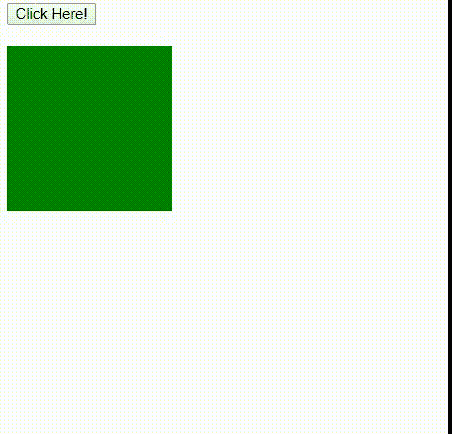
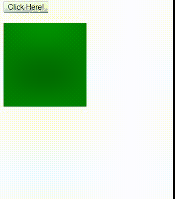

# HTML DOM 样式 transitionTimingFunction 属性

> 原文：[https://www.geeksforgeeks.org/html-dom-style-transitiontimingfunction-property/](https://www.geeksforgeeks.org/html-dom-style-transitiontimingfunction-property/)

`transitionTimingFunction` 属性允许过渡效果在其持续时间内改变速度。过渡效果提供了一种在更改属性时控制动画速度的方法。

## 语法

设置属性：
```html
object.style.transitionTimingFunction = "ease|linear|ease-in|ease-out|ease-in-out"
```

获取属性：
```html
object.style.transitionTimingFunction
```

**返回值：** 它返回一个字符串，代表元素的转换定时函数属性。

## 属性值

*   `ease`：指定开始缓慢，然后快速，然后缓慢的过渡效果。
*   `linear`：指定从开始到结束速度相同的过渡效果。
*   `ease-in`：指定缓慢开始的过渡效果。
*   `ease-out`：指定一个缓慢结束的过渡效果。
*   `ease-in-out`：指定缓慢开始和结束的过渡效果。

## 例 1

本例描述 `linear` 属性值。

```html
<!DOCTYPE html>
<html>
<head>
    <title>HTML | DOM Style transitionTimingFunction property</title>
    <style>
        #GFG {
            background-color: green;
            width: 150px;
            height: 150px;
            overflow: auto;
            /* For Safari Browser */
            -webkit-transition: all 2s;
            transition: all 2s;
        }
        #GFG:hover {
            width: 300px;
            height: 300px;
        }
    </style>
</head>
<body>
    <button onclick="myGeeks()">Click Here!</button>
    <br><br>
    <div id="GFG"></div>
    <script>
        function myGeeks() {
            /* For Safari Browser */
            document.getElementById("GFG").style.WebkitTransitionTimingFunction = "linear";
            document.getElementById("GFG").style.transitionTimingFunction = "linear";
        }
    </script>
</body>
</html>
```

**输出：**


## 示例 2

本示例描述了 `ease-in` 属性值。

```html
<!DOCTYPE html>
<html>
<head>
    <title>HTML | DOM Style transitionTimingFunction property</title>
    <style>
        #GFG {
            background-color: green;
            width: 150px;
            height: 150px;
            overflow: auto;
            /* For Safari Browser */
            -webkit-transition: all 2s;
            transition: all 2s;
        }
        #GFG:hover {
            width: 300px;
            height: 300px;
        }
    </style>
</head>
<body>
    <button onclick="myGeeks()">Click Here!</button>
    <br><br>
    <div id="GFG"></div>
    <script>
        function myGeeks() {
            /* For Safari Browser */
            document.getElementById("GFG").style.WebkitTransitionTimingFunction = "ease-in";
            document.getElementById("GFG").style.transitionTimingFunction = "ease-in";
        }
    </script>
</body>
</html>
```

**输出：**


**注意：** 在 Safari 浏览器中使用 `WebkitTransitionTimingFunction` 作为关键字。

## 支持的浏览器

以下是支持 `transitionTimingFunction` 属性的浏览器：

*   Google Chrome 26.0
*   Internet Explorer 10.0
*   Mozilla Firefox 16.0
*   Opera 12.1
*   Safari 6.1, 3.1 (使用 `WebkitTransitionTimingFunction`)