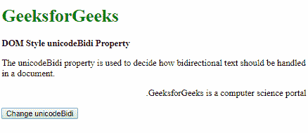
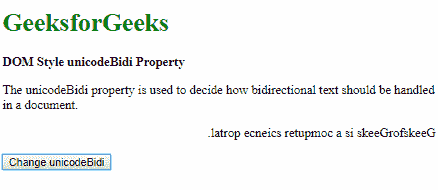
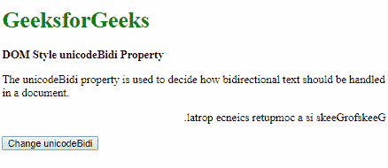
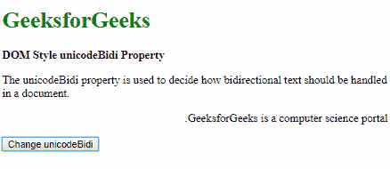

# HTML DOM 样式 unicodeBidi 属性

> 原文：[https://www.geeksforgeeks.org/html-dom-style-unicodebidi-property/](https://www.geeksforgeeks.org/html-dom-style-unicodebidi-property/)

HTML DOM 中的 `Style unicodeBidi` 属性与 `direction` 属性一起使用，确定多方向文本的显示方式。它覆盖默认的 Unicode 算法，并赋予开发人员控制文本嵌入的权限。

## 语法

*   它返回 `unicodeBidi` 属性。

```html
object.style.unicodeBidi
```

*   它用于设置 `unicodeBidi` 属性。

```html
object.style.unicodeBidi = "embed|bidi-override|normal|initial|inherit"
```

## 返回值

返回一个字符串值，代表双向算法的嵌入级别。

## 属性值

### `embed`
此值用于创建一个额外的嵌入级别。

**示例：**

```html
<!DOCTYPE html>
<html>
<head>
    <title>DOM Style unicodeBidi Property</title>
    <style>
        .content {
            direction: rtl;
            unicode-bidi: bidi-override;
        }
    </style>
</head>
<body>
    <h1 style="color: green">GeeksforGeeks</h1>
    <b>DOM Style unicodeBidi Property</b>
    <p>The unicodeBidi property is used to decide how bidirectional text should be handled in a document.</p>
    <p class="content">GeeksforGeeks is a computer science portal.</p>
    <button onclick="setUnicodeBidi()">Change unicodeBidi</button>
    <!-- Script to use Style unicodeBidi Property -->
    <script>
        function setUnicodeBidi() {
            elem = document.querySelector('.content');
            elem.style.unicodeBidi = 'embed';
        }
    </script>
</body>
</html>
```

**输出：**

*   点击按钮前：
    
*   点击按钮后：
    

### `bidi-override`
此值用于创建一个额外的嵌入级别。它还会根据 `direction` 属性指定的方向重新排序文本。

**示例：**

```html
<!DOCTYPE html>
<html>
<head>
    <title>DOM Style unicodeBidi Property</title>
    <style>
        .content {
            direction: rtl;
        }
    </style>
</head>
<body>
    <h1 style="color: green">GeeksforGeeks</h1>
    <b>DOM Style unicodeBidi Property</b>
    <p>The unicodeBidi property is used to decide how bidirectional text should be handled in a document.</p>
    <p class="content">GeeksforGeeks is a computer science portal.</p>
    <button onclick="setUnicodeBidi()">Change unicodeBidi</button>
    <!-- Script to use Style unicodeBidi Property -->
    <script>
        function setUnicodeBidi() {
            elem = document.querySelector('.content');
            elem.style.unicodeBidi = 'bidi-override';
        }
    </script>
</body>
</html>
```

**输出：**

*   点击按钮前：
    
*   点击按钮后：
    

### `normal`
此值不创建任何额外的嵌入级别。它是默认值。

**示例：**

```html
<!DOCTYPE html>
<html>
<head>
    <title>DOM Style unicodeBidi Property</title>
    <style>
        .content {
            direction: rtl;
            unicode-bidi: bidi-override;
        }
    </style>
</head>
<body>
    <h1 style="color: green">GeeksforGeeks</h1>
    <b>DOM Style unicodeBidi Property</b>
    <p>The unicodeBidi property is used to decide how bidirectional text should be handled in a document.</p>
    <p class="content">GeeksforGeeks is a computer science portal.</p>
    <button onclick="setUnicodeBidi()">Change unicodeBidi</button>
    <!-- Script to use Style unicodeBidi Property -->
    <script>
        function setUnicodeBidi() {
            elem = document.querySelector('.content');
            elem.style.unicodeBidi = 'normal';
        }
    </script>
</body>
</html>
```

**输出：**

*   点击按钮前：
    
*   点击按钮后：
    

### `initial`
用于将此属性设置为其默认值。

**示例：**

```html
<!DOCTYPE html>
<html>
<head>
    <title>DOM Style unicodeBidi Property</title>
    <style>
        .content {
            direction: rtl;
            unicode-bidi: bidi-override;
        }
    </style>
</head>
<body>
    <h1 style="color: green">GeeksforGeeks</h1>
    <b>DOM Style unicodeBidi Property</b>
    <p>The unicodeBidi property is used to decide how bidirectional text should be handled in a document.</p>
    <p class="content">GeeksforGeeks is a computer science portal.</p>
    <button onclick="setUnicodeBidi()">Change unicodeBidi</button>
    <!-- Script to use Style unicodeBidi Property -->
    <script>
        function setUnicodeBidi() {
            elem = document.querySelector('.content');
            elem.style.unicodeBidi = 'initial';
        }
    </script>
</body>
</html>
```

**输出：**

*   点击按钮前：
    
*   点击按钮后：
    

### `inherit`
从其父元素继承该属性。

**示例：**

```html
<!DOCTYPE html>
<html>
<head>
    <title>DOM Style unicodeBidi Property</title>
    <style>
        #parent {
            unicode-bidi: bidi-override;
        }
        .content {
            direction: rtl;
        }
    </style>
</head>
<body>
    <h1 style="color: green">GeeksforGeeks</h1>
    <b>DOM Style unicodeBidi Property</b>
    <p>The unicodeBidi property is used to decide how bidirectional text should be handled in a document.</p>
    <div id="parent">
        <p class="content">GeeksforGeeks is a computer science portal.</p>
    </div>
    <button onclick="setUnicodeBidi()">Change unicodeBidi</button>
    <!-- Script to use Style unicodeBidi Property -->
    <script>
        function setUnicodeBidi() {
            elem = document.querySelector('.content');
            elem.style.unicodeBidi = 'inherit';
        }
    </script>
</body>
</html>
```

**输出：**

*   点击按钮前：
    
*   点击按钮后：
    

## 支持的浏览器

以下列出了 `DOM Style unicodeBidi` 属性支持的浏览器：

*   谷歌 Chrome
*   微软 Edge
*   火狐浏览器
*   Opera
*   苹果 Safari