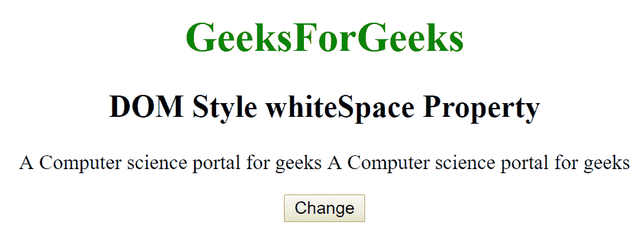
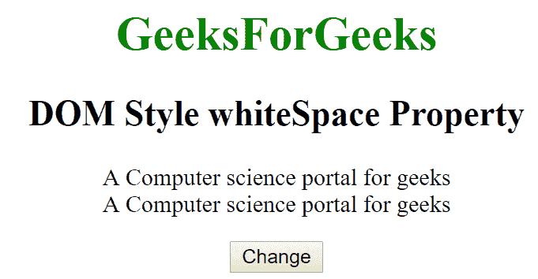
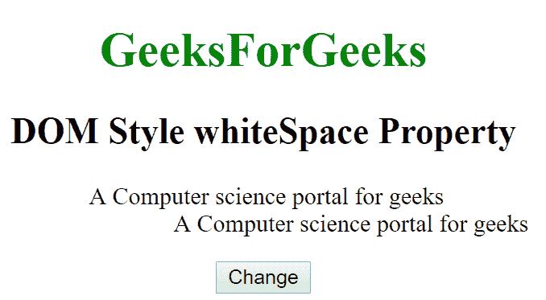

# HTML DOM style whiteSpace 属性

> 原文：[https://www.geeksforgeeks.org/html-dom-style-whitespace-property/](https://www.geeksforgeeks.org/html-dom-style-whitespace-property/)

HTML DOM 中的 `style.whiteSpace` 属性用于设置文本内容的空白处理方式。它返回元素的 `whiteSpace` 属性。

**语法：**

*   获取属性值：
    ```html
    object.style.whiteSpace
    ```

*   设置属性值：
    ```html
    object.style.whiteSpace = "normal|nowrap|pre|pre-line|pre-wrap|initial|inherit"
    ```

**属性值：**

*   `normal`：用于将空白折叠成单个空白，并将文本换行。这是一个默认值。
*   `nowrap`：用于将空白折叠成单个空白，禁止文本换行。
*   `pre`：用于定义预格式化文本，保留空白和换行。
*   `pre-line`：用于将空白折叠为单个空格，但保留换行符。
*   `pre-wrap`：用于保留空白和换行符，但正常换行。
*   `initial`：它将 `whiteSpace` 属性设置为其默认值。
*   `inherit`：该属性从其父元素继承而来。

**返回值：** 返回一个代表元素 `whiteSpace` 属性的字符串。

## 例 1

```html
<!DOCTYPE html>
<html>
    <head>
        <title>
            DOM Style whiteSpace Property
        </title>
    </head>

    <body>
        <center>
            <h1 style = "color:green;">
                GeeksForGeeks
            </h1>

            <h2>
                DOM Style whiteSpace Property
            </h2>

            <p id = "gfg">
                A Computer science portal for geeks
                A Computer science portal for geeks
            </p>

            <button type = "button" onclick = "geeks()">
                Change
            </button>

            <script>
                function geeks() {
                    document.getElementById("gfg").style.whiteSpace
                                = "pre-line";
                }
            </script>
        </center>
    </body>
</html>
```

**输出：**

**点击按钮之前：**



**点击按钮之后：**



## 例 2

```html
<!DOCTYPE html>
<html>
    <head>
        <title>
            DOM Style whiteSpace Property
        </title>
    </head>

    <body>
        <center>
            <h1 style = "color:green;">
                GeeksForGeeks
            </h1>

            <h2>
                DOM Style whiteSpace Property
            </h2>

            <p id = "gfg">A Computer science portal for geeks
                A Computer science portal for geeks
            </p>

            <button type = "button" onclick = "geeks()">
                Change
            </button>

            <script>
                function geeks() {
                    document.getElementById("gfg").style.whiteSpace
                                = "pre-wrap";
                }
            </script>
        </center>
    </body>
</html>
```

**输出：**

**点击按钮之前：**


**点击按钮之后：**



**支持的浏览器：** 由 `style.whiteSpace` 属性支持的浏览器如下：

*   Apple Safari
*   Google Chrome
*   Firefox
*   Microsoft Edge
*   Opera