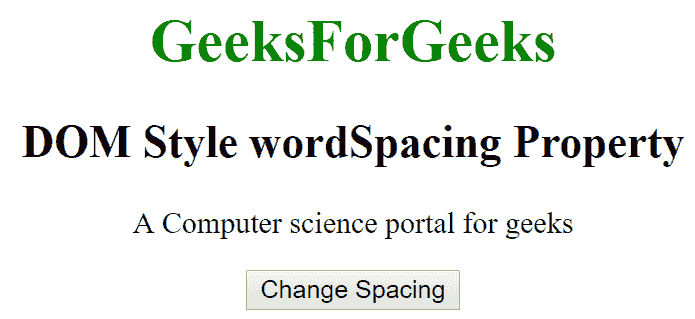
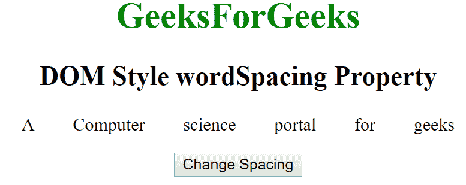
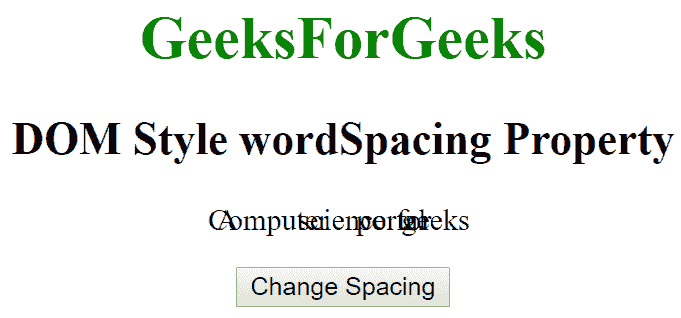

# HTML DOM Style wordSpacing 属性

> 原文：[https://www.geeksforgeeks.org/html-dom-style-wordspacing-property/](https://www.geeksforgeeks.org/html-dom-style-wordspacing-property/)

HTML DOM 中的 Style `wordSpacing` 属性用于设置单词之间的间距。它也可以用来指定单词之间的间距。它返回文本中单词之间的间距。

## 语法

*   它返回单词间距属性。
    ```html
    object.style.wordSpacing
    ```
*   它用于设置单词间距属性。
    ```html
    object.style.wordSpacing = "normal|length|initial|inherit"
    ```

## 属性值

*   `normal`：用于指定单词之间的正常间距。这是一个默认值。
*   `length`：用于以长度单位指定单词之间的间距。它可以允许负值。
*   `initial`：将单词间距属性设置为默认值。
*   `inherit`：该属性从其父元素继承而来。

## 返回值

返回一个字符串，代表文本中单词之间的间距。

## 示例 1

### HTML

```html
<!DOCTYPE html>
<html>
<head>
    <title>DOM Style wordSpacing Property </title>
</head>
<body>
    <center>
        <h1 style="color:green;">
            GeeksForGeeks
        </h1>
        <h2>DOM Style wordSpacing Property </h2>
        <p id="gfg"> A Computer science portal for geeks</p>
        <button type="button" onclick="geeks()">
            Change Decoration
        </button>
        <script>
            function geeks() {
                document.getElementById("gfg").style.wordSpacing = "30px";
            }
        </script>
    </center>
</body>
</html>
```

### 输出

*   点击按钮前：
    
*   点击按钮后：
    

## 示例 2

### HTML

```html
<!DOCTYPE html>
<html>
<head>
    <title>DOM Style wordSpacing Property </title>
    <style>
    </style>
</head>
<body>
    <center>
        <h1 style="color:green;;">
            GeeksForGeeks
        </h1>
        <h2>DOM Styles wordSpacingProperty </h2>
        <p id="gfg"> A Computer science portal for geeks</p>
        <button type="button" onclick="geeks()">
            Change Decoration
        </button>
        <script>
            function geeks() {
                document.getElementById("gfg").style.wordSpacing = "-20px";
            }
        </script>
    </center>
</body>
</html>
```

### 输出

*   点击按钮前：
    
*   点击按钮后：
    

## 支持的浏览器

DOM Style `wordSpacing` 属性支持的浏览器如下：

*   谷歌 Chrome
*   微软 Edge
*   火狐浏览器
*   Opera
*   苹果 Safari