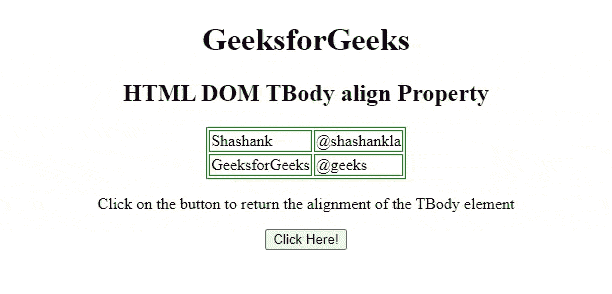
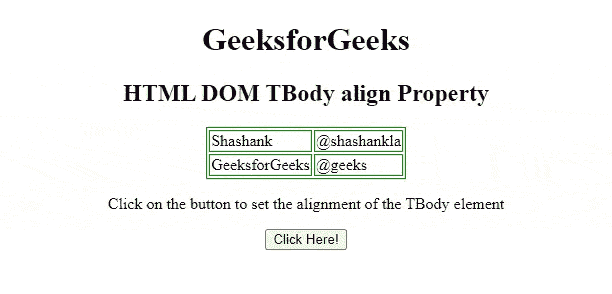

# HTML DOM Tbody align 属性

> 原文: [https://www.geeksforgeeks.org/html-dom-tbody-align-property/](https://www.geeksforgeeks.org/html-dom-tbody-align-property/)

`HTML` `DOM` `Tbody` `align` 属性用于设置或返回 [`<tbody>`](https://www.geeksforgeeks.org/html-tbody-tag/) 元素内内容的水平对齐。HTML5 不支持它。

**语法:**

*   它返回 `align` 属性。
    ```html
    tbodyObject.align
    ```
*   它设置 `align` 属性。
    ```html
    tbodyObject.align = "left | right | center"
    ```

**属性值:**

*   **left:** 将文本设置为左对齐。
*   **right:** 设置文本右对齐。
*   **center:** 设置文本居中对齐。
*   **justify:** 拉伸段落文本，使所有行的宽度相等。
*   **char:** 它将文本对齐设置为特定字符。

**返回值:** 它返回一个字符串值，表示元素的对齐方式。

**示例:** 下面的 HTML 代码说明了如何返回 `tbody` `align` 属性。

## HTML

```html
<!DOCTYPE html>
<html>
<head>
    <style>
        table, th, td {
            border: 1px solid green;
        }
    </style>
</head>
<body>
    <center>
        <h1>GeeksforGeeks</h1>
        <h2>HTML DOM TBody align Property</h2>
        <table>
            <tbody id="tbodyID" align="left">
                <tr>
                    <td>Shashank</td>
                    <td>@shashankla</td>
                </tr>
                <tr>
                    <td>GeeksforGeeks</td>
                    <td>@geeks</td>
                </tr>
            </tbody>
        </table>
        <p>Click on the button to return the alignment of the TBody element</p>
        <button onclick="btnclick()">Click Here!</button>
        <p id="paraID"></p>
    </center>
    <script>
        function btnclick() {
            var tbody = document.getElementById("tbodyID").align;
            document.getElementById("paraID").innerHTML = tbody;
        }
    </script>
</body>
</html>
```

**输出:**



**示例 2:** 下面的 HTML 代码说明了如何设置 `tbody` `align` 属性。

## HTML

```html
<!DOCTYPE html>
<html>
<head>
    <style>
        table, th, td {
            border: 1px solid green;
        }
    </style>
</head>
<body>
    <center>
        <h1>GeeksforGeeks</h1>
        <h2>HTML DOM TBody align Property</h2>
        <table>
            <tbody id="tbodyID" align="left">
                <tr>
                    <td>Shashank</td>
                    <td>@shashankla</td>
                </tr>
                <tr>
                    <td>GeeksforGeeks</td>
                    <td>@geeks</td>
                </tr>
            </tbody>
        </table>
        <p>Click on the button to set the alignment of the TBody element</p>
        <button onclick="btnclick()">Click Here!</button>
        <p id="paraID"></p>
    </center>
    <script>
        function btnclick() {
            var tbody = document.getElementById("tbodyID").align = "right";
            document.getElementById("paraID").innerHTML = tbody;
        }
    </script>
</body>
</html>
```

**输出:**



**支持的浏览器:**

*   Google Chrome
*   Internet Explorer
*   Firefox
*   Safari
*   Opera