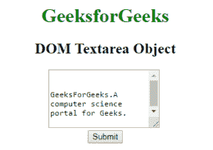
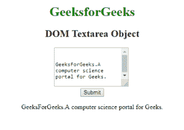
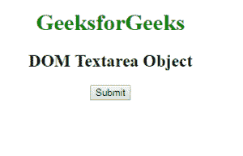
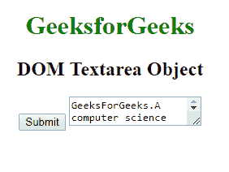

# HTML DOM Textarea 对象

> 原文：[https://www.geeksforgeeks.org/html-dom-textarea-object/](https://www.geeksforgeeks.org/html-dom-textarea-object/)

HTML DOM 中的 `Textarea` 对象用来表示 HTML `textarea` 元素。可以使用 `getElementById()` 方法访问 `textarea` 元素。

## 语法

```html
document.getElementById("ID");
```

其中 `ID` 被分配给 `<textarea>` 元素。

## 属性

*   **autofocus**：用于设置或返回页面加载时元素是否应该对焦。
*   **cols**：用于设置或返回 `textarea` 元素的 `cols` 属性的值。
*   **defaultValue**：用于设置或返回 `textarea` 元素的 `defaultValue`。
*   **disabled**：用于设置或返回 `textarea` 元素的 `disabled` 属性的值。
*   **form**：用于返回包含 `textarea` 字段的表单的引用。
*   **maxLength**：用于设置或返回 `textarea` 字段的 `maxLength` 属性的值。
*   **name**：用于设置或返回 `textarea` 字段的 `name` 属性。
*   **placeholder**：用于设置或返回文本区域字段的 `placeholder` 属性的值。
*   **readOnly**：用于返回 `textarea` 字段的 `readOnly` 属性值。
*   **required**：用于设置或返回提交表单前是否必须填写输入元素。
*   **rows**：用于设置或返回 `textarea` 字段的 `rows` 属性的值。
*   **type**：用于返回 `textarea` 字段的类型属性的值。
*   **value**：用于设置或返回文本区域字段的内容。
*   **wrap**：用于返回 `textarea` 字段的 `wrap` 属性值。

## 方法

*   **select()**：用于选择文本区域字段中的所有全部内容。

## 示例 1

本示例描述了访问 `<textarea>` 元素的 `getElementById()` 方法。

### HTML

```html
<!DOCTYPE html>
<html>
    <head>
        <title>
            HTML DOM Textarea Object
        </title>
    </head>

<body style = "text-align:center">

<h1 style = "color: green;">
            GeeksforGeeks
        </h1>

<h2>DOM Textarea Object</h2>

<!--A disabled textarea-->
        <textarea id = "myGeeks">
            GeeksForGeeks. A computer science portal for Geeks.
        </textarea>

<br>

<button onclick = "Geeks()">
            Submit
        </button>

<p id = "sudo"></p>

<script>
            function Geeks() {
                var x = document.getElementById("myGeeks").value;
                document.getElementById("sudo").innerHTML = x;
            }
        </script>
    </body>
</html>
```

**输出：**

**点击按钮之前：**



**点击按钮之后：**



## 示例 2

可以使用 `document.createElement` 方法创建文本区域对象。

### HTML

```html
<!DOCTYPE html>
<html>
    <head>
        <title>
            HTML DOM Textarea Object
        </title>
    </head>

<body style = "text-align:center">

<h1 style = "color: green;">
            GeeksforGeeks
        </h1>

<h2>DOM Textarea Object</h2>

<button onclick = "Geeks()">
            Submit
        </button>

<!-- script to create textarea -->
        <script>
            function Geeks() {
                // textarea tag is created
                var g = document.createElement("TEXTAREA");
                var f = document.createTextNode(
                    "GeeksForGeeks. A computer science portal for Geeks.");
                g.appendChild(f);
                document.body.appendChild(g);
            }
        </script>
    </body>
</html>
```

**输出：**

**点击按钮之前：**



**点击按钮之后：**



## 支持的浏览器

`DOM Textarea` 对象支持的浏览器如下：

*   Google Chrome
*   Internet Explorer
*   Firefox
*   Opera
*   Safari