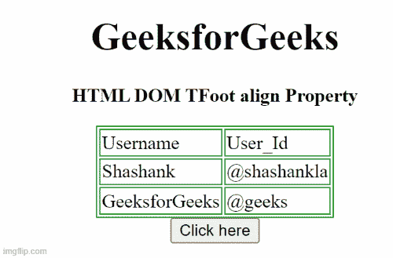

# HTML DOM TFoot align 属性

> 原文：[https://www.geeksforgeeks.org/html-dom-tfoot-align-property/](https://www.geeksforgeeks.org/html-dom-tfoot-align-property/)

`HTML DOM TFoot align` 属性用于设置或返回 `<tfoot>` 元素内内容的水平对齐。HTML 5 不支持。

## 语法

```html
tfootObject.align = "left | right | center"
```

## 属性值

*   `left`: 设置文本左对齐。
*   `right`: 设置文本右对齐。
*   `center`: 设置文本居中对齐。
*   `justify`: 拉伸段落文本，使所有行的宽度相等。
*   `char`: 它将文本对齐设置为特定字符。

## 返回值

返回一个字符串值，代表 `<tfoot>` 元素的水平对齐方式。

## 示例 1

下面的 HTML 代码说明了如何返回 `TFoot align` 属性。

### HTML

```html
<!DOCTYPE html>
<html>
<head>
    <style>
        table, th, td {
            border: 1px solid green;
        }
    </style>
</head>
<body>
    <center>
        <h1>GeeksforGeeks</h1>
        <p><b>HTML DOM TFoot align Property </b></p>
        <table>
            <thead>
                <tr>
                    <td>Username</td>
                    <td>User_Id</td>
                </tr>
            </thead>
            <tbody>
                <tr>
                    <td>Shashank</td>
                    <td>@shashankla</td>
                </tr>
                <tfoot id="GFG" align="left">
                    <tr>
                        <td>GeeksforGeeks</td>
                        <td>@geeks</td>
                    </tr>
                </tfoot>
            </tbody>
        </table>
        <button onclick="btnclick()"> Click here </button>
        <p id="paraID"></p>
    </center>
    <script>
        function btnclick() {
            var x = document.getElementById("GFG").align;
            document.getElementById("paraID").innerHTML = x;
        }
    </script>
</body>
</html>
```

**输出:**


## 示例 2

下面的 HTML 代码说明了如何设置 `TFoot align` 属性。

### HTML

```html
<!DOCTYPE html>
<html>
<head>
    <style>
        table, th, td {
            border: 1px solid green;
        }
    </style>
</head>
<body>
    <center>
        <h1>GeeksforGeeks</h1>
        <p><b>HTML DOM TFoot align Property </b></p>
        <table>
            <thead>
                <tr>
                    <td>Username</td>
                    <td>User_Id</td>
                </tr>
            </thead>
            <tbody>
                <tr>
                    <td>Shashank</td>
                    <td>@shashankla</td>
                </tr>
                <tfoot id="GFG" align="left">
                    <tr>
                        <td>GeeksforGeeks</td>
                        <td>@geeks</td>
                    </tr>
                </tfoot>
            </tbody>
        </table>
        <button onclick="btnclick()"> Click here </button>
        <p id="paraID"></p>
    </center>
    <script>
        function btnclick() {
            var x = document.getElementById("GFG").align = "right";
            document.getElementById("paraID").innerHTML = x;
        }
    </script>
</body>
</html>
```

**输出:**

