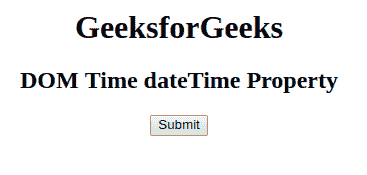
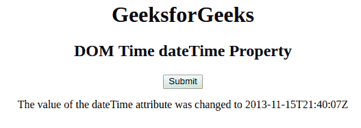
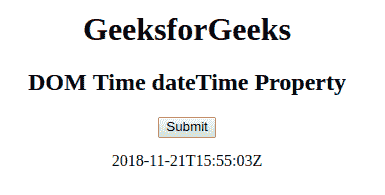

# HTML DOM Time dateTime 属性

> 原文：[https://www.geeksforgeeks.org/html-dom-time-datetime-property/](https://www.geeksforgeeks.org/html-dom-time-datetime-property/)

**DOM Time dateTime 属性**用于**设置**或**返回** `<time>` 元素的 `dateTime` 属性的值。日期时间以格式 **YYYY-MM-DDThh:mm:ssTZD** 插入。

## 语法

*   它用于返回 `dateTime` 属性。
    ```html
    timeObject.dateTime
    ```
*   它用于设置 `dateTime` 属性。
    ```html
    timeObject.dateTime = YYYY-MM-DDThh:mm:ssTZD
    ```

## 属性值

*   **YYYY-MM-DDThh:mm:ssTZD**：它指定日期和时间。

## 说明

*   **YYYY** – 年份（如 2009 年）
*   **MM** – 月（如 01 代表 1 月）
*   **DD** – 一个月中的某一天（例如 04）
*   **T** – 所需的分隔符
*   **hh** – 小时（例如 20）
*   **mm** – 分钟（例如 35）
*   **ss** – 秒（例如 09）
*   **TZD** – 时区指示器（Z 表示祖鲁语，也称为格林威治标准时间）

## 返回值

返回表示日期和时间的字符串值。

## 示例-1

本示例设置 `dateTime` 属性。

```html
<!DOCTYPE html>
<html>
<head>
    <title>
        HTML DOM Time dateTime Property
    </title>
</head>
<body style="text-align:center;">
    <h1>GeeksforGeeks</h1>
    <h2>
        DOM Time dateTime Property
    </h2>
    <p>
        <time id="GFG" datetime="2018-11-21T15:55:03Z">
        </time>
    </p>
    <button onclick="myGeeks()">
        Submit
    </button>
    <p id="sudo"></p>
    <script>
        function myGeeks() {
            var g = document.getElementById("GFG").dateTime = "2013-11-15T21:40:07Z";
            document.getElementById("sudo").innerHTML =
                "The value of the dateTime attribute was changed to " + g;
        }
    </script>
</body>
</html>
```

**输出：**

**点击按钮前：**


**点击按钮后：**


## 示例-2

本示例返回 `dateTime` 属性。

```html
<!DOCTYPE html>
<html>
<head>
    <title>
        HTML DOM Time dateTime Property
    </title>
</head>
<body style="text-align:center;">
    <h1>
        GeeksforGeeks
    </h1>
    <h2>
        DOM Time dateTime Property
    </h2>
    <time id="GFG" datetime="2018-11-21T15:55:03Z">
    </time>
    <button onclick="myGeeks()">
        Submit
    </button>
    <p id="sudo"></p>
    <script>
        function myGeeks() {
            var g = document.getElementById("GFG").dateTime;
            document.getElementById("sudo").innerHTML = g;
        }
    </script>
</body>
</html>
```

**输出：**

**点击按钮前：**


**点击按钮后：**


## 支持的浏览器

只有 **Firefox** 是支持 `DOM Time dateTime` 属性的浏览器。