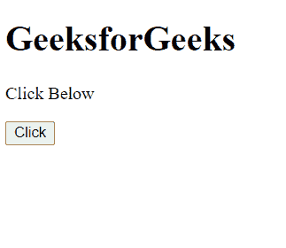
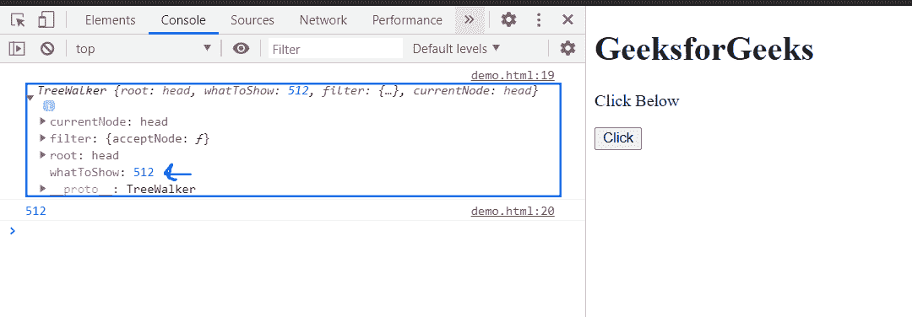

# HTML DOM TreeWalker whatToShow 属性

> 原文：[https://www.geeksforgeks.org/html-dom-treewalker-whattoshow-property/](https://www.geeksforgeks.org/html-dom-treewalker-whattoshow-property/)

`TreeWalker.whatToShow` 属性返回一个无符号整数，描述必须呈现的节点类型。这是只读属性。

## 语法

```html
whatToShow = treeWalker.whatToShow;
```

## 返回值

该属性返回一个无符号整数，描述必须呈现的节点类型。

以下是无符号常量的可能值。

| 常量 | 返回值 | 常量描述 |
| :--- | :--- | :--- |
| `NodeFilter.SHOW_ALL` | 1 | 显示所有节点。 |
| `NodeFilter.SHOW_COMMENT` | 128 | 显示注释节点。 |
| `NodeFilter.SHOW_DOCUMENT` | 256 | 显示文档节点。 |
| `NodeFilter.SHOW_DOCUMENT_FRAGMENT` | 1024 | 显示文档片段节点。 |
| `NodeFilter.SHOW_DOCUMENT_TYPE` | 512 | 显示文档类型节点。 |
| `NodeFilter.SHOW_ELEMENT` | 1 | 显示元素节点。 |
| `NodeFilter.SHOW_PROCESSING_INSTRUCTION` | 64 | 显示处理指令节点。 |
| `NodeFilter.SHOW_TEXT` | 4 | 显示文本节点。 |

## 示例

此示例有 `NodeFilter.FILTER_ACCEPT` 作为节点筛选器，因此分别返回 `whatToShow` 值。

```html
<!doctype html>
<html>
<head>
    <meta charset="utf-8">
<title>HTML DOM TreeWalker whatToShow property</title>    
</head>
<body>
    <h1>GeeksforGeeks</h1>
    <p>Click Below</p>
    <button onclick="get()">Click</button>
</body>
<script>
        var treeWalker = 
document.createTreeWalker(document.head,NodeFilter.SHOW_DOCUMENT_TYPE,
        { acceptNode: function(node) {
          return NodeFilter.FILTER_ACCEPT; } },
    false
);
        function get(){
            node = treeWalker.whatToShow;
            console.log(treeWalker)
            console.log(node);
        }
</script>
</html>
```

## 输出

**按钮点击前：**



**按钮点击后：**



## 支持的浏览器

*   谷歌 Chrome
*   边缘
*   火狐浏览器
*   旅行队
*   歌剧
*   微软公司出品的 web 浏览器