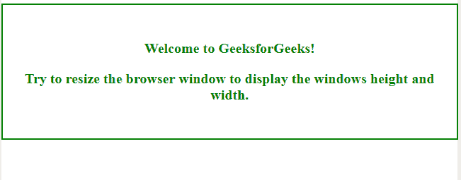
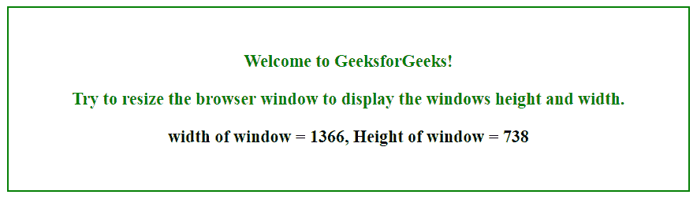
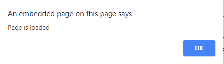

# HTML DOM UIEvent

HTML 中的 `DOM UiEvent` 是属于 `UiEvent` 对象的用户界面触发的事件。
用户界面事件的两个主要目的是:

*   允许注册事件侦听器，并通过树结构描述事件流。
*   提供现有浏览器中使用的当前事件系统的公共子集。

## 语法

```html
Event_name = function
```

**返回值:** 这将返回附加了指定事件的对象。

属于 `事件对象` 的 `事件类型` 有:

| **事件** | 功能 |
| :--- | :--- |
| `abort` | 当介质加载中止时，会发生此事件。 |
| `beforeunload` | 此事件发生在文档即将卸载之前 |
| `error` | 当加载媒体文件时发生错误时，会发生此事件。 |
| `load` | 当加载了对象时，会发生此事件。 |
| `resize` | 当调整文档视图大小时，会发生此事件。 |
| `scroll` | 当滚动元素的滚动条时，会发生此事件。 |
| `select` | 该事件发生在用户选择一些文本(`input` 和 `textarea`)之后。 |
| `unload` | 一旦页面卸载(对于 `body`)，就会发生此事件。 |

## 示例 1

本例基于 `onresize` 事件。

```html
<!DOCTYPE html>
<html>
<style>
    body {
        width: 90%;
        color: green;
        border: 2px solid green;
        height: 40%;
        font-weight: bold;
        text-align: center;
        padding: 30px;
        font-size: 20px;
    }

    #demo {
        color: black;
    }
</style>

<!-- 'onresize' event -->
<body onresize="mainFunction()">
    <p>Welcome to GeeksforGeeks!</p>
    <p>Try to resize the browser window to display the windows height and width.</p>

    <p id="demo"></p>

    <script>
        function mainFunction() {
            var w = window.outerWidth;
            var h = window.outerHeight;
            var txt = "width of window = " + w + ", Height of window = " + h;

            document.getElementById("demo").innerHTML = txt;
        }
    </script>

</body>

</html>
```

**输出:**

**初始:**


**当窗口宽度增加到 110%时宽度和高度的值将为:**


## 示例 2

本例基于 `onload` 事件。

```html
<!DOCTYPE html>
<html>
<style>
    body {
        width: 90%;
        color: green;
        border: 2px solid green;
        height: 40%;
        font-weight: bold;
        text-align: center;
        padding: 30px;
        font-size: 20px;
    }

    #demo {
        color: black;
    }
</style>

<!-- 'onload' event. -->

<body onload="myFunction()">

    <p>Welcome to GeeksforGeeks!</p>
    <p>This page loaded.</p>

    <script>
        function myFunction() {
            alert("Page is loaded");
        }
    </script>

</body>

</html>
```

**页面加载时:**


## 支持的浏览器

*   Google Chrome
*   Mozilla Firefox
*   Edge
*   Safari
*   Opera