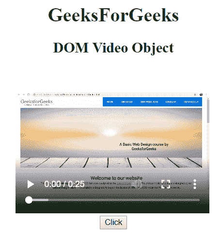
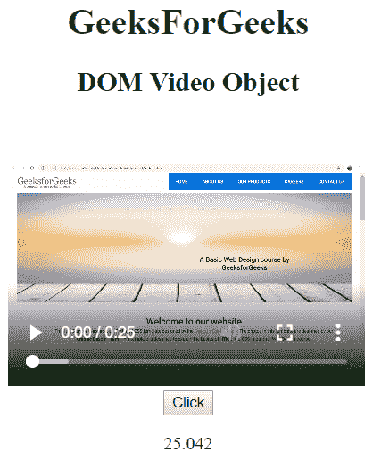
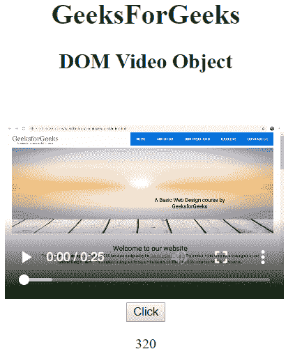

# HTML | DOM 视频对象

> 原文: [https://www.geeksforgeeks.org/html-dom-video-object/](https://www.geeksforgeeks.org/html-dom-video-object/)

HTML DOM 中的`视频对象`代表一个`<video>`元素。可以使用`getElementById()`方法访问视频元素。

**语法:**

*   访问视频对象：

```html
document.getElementById("videoId");
```

其中`id`被分配给`<video>`标签。

*   创建视频对象：

```html
document.createElement("VIDEO");
```

## 属性值

| 属性 | 描述 |
| :--- | :--- |
| `audioTracks` | 它返回一个`AudioTrackList`对象，表示可用的音轨。 |
| `autoplay` | 它用于设置或返回视频是否应在准备好后立即开始播放。 |
| `buffered` | 它返回代表视频缓冲部分的时间范围对象。 |
| `controller` | 它返回`MediaController`对象，该对象表示视频的当前媒体控制器。 |
| `controls` | 它用于设置或返回视频是否应该显示播放和暂停控制。 |
| `crossOrigin` | 它设置或返回视频的CORS设置。 |
| `currentSrc` | 它返回当前视频的网址。 |
| `currentTime` | 它设置或返回视频中的当前播放位置。 |
| `defaultMuted` | 它设置或返回视频是否默认静音。 |
| `defaultPlaybackRate` | 它设置或返回视频的默认播放速度。 |
| `duration` | 它返回视频的长度。 |
| `ended` | 用于返回视频播放是否结束。 |
| `error` | 它返回一个`MediaError`对象，表示视频的错误状态。 |
| `height` | 它用于设置或返回视频的高度属性值。 |
| `loop` | 它用于设置或返回视频是否应该在每次结束时重新播放。 |
| `mediaGroup` | 它用于设置或返回该视频的媒体组名称。 |
| `muted` | 它用于设置或返回是否关闭视频声音。 |
| `networkState` | 它返回视频的当前网络状态。 |
| `paused` | 它返回视频是否暂停。 |
| `playbackRate` | 它用于设置或返回视频播放速度。 |
| `played` | 它返回一个代表视频播放部分的时间范围对象。 |
| `poster` | 它用于设置或返回视频海报属性的值。 |
| `preload` | 它用于设置或返回视频的预加载属性值。 |
| `readyState` | 它用于返回视频的当前就绪状态。 |
| `seekable` | 它用于返回代表视频中可查找部分的时间范围对象。 |
| `seeking` | 它返回用户当前是否在视频中寻找。 |
| `src` | 它用于设置或返回视频的`src`属性值。 |
| `startDate` | 它用于返回当前时间偏移的`Date`对象。 |
| `textTracks` | 它用于返回表示可用文本轨道的`TextTrackList`对象。 |
| `videoTracks` | 它用于返回代表可用视频轨道的`VideoTrackList`对象。 |
| `volume` | 它用于设置或返回视频的音量。 |
| `width` | 它用于设置或返回视频的宽度属性值。 |

## 视频对象方法

*   `pause()`: 用于暂停当前正在播放的视频。
*   `load()`: 用于重新加载视频元素。
*   `play()`: 用于开始播放视频。
*   `addTextTrack()`: 用于给视频添加新的文本轨道。
*   `canPlayType()`: 用于检查浏览器是否可以播放指定的视频类型。

## 示例-1

```html
<!DOCTYPE html>
<html>
<head>
    <title>
        DOM Input Video Object
    </title>
</head>
<body>
    <center>
        <h1 style="color:green;">
            GeeksForGeeks
        </h1>
        <h2>DOM Video Object</h2>
        <video id="gfg"
               width="320"
               height="240"
               controls>
            <source src="https://media.geeksforgeeks.org/wp-content/uploads/project.mp4"
                    type="video/mp4">
        </video>
        <br>
        <button type="button" onclick="geeks()">
            Click
        </button>
        <p id="rk"></p>
        <script>
            function geeks() {
                // get the duration of video
                var r = document.getElementById("gfg").duration;
                document.getElementById("rk").innerHTML = r;
            }
        </script>
    </center>
</body>
</html>
```

**输出:**

*   之前点击按钮:
    
*   点击按钮后:
    

## 示例-2

```html
<!DOCTYPE html>
<html>
<head>
    <title>
        DOM Input Video Object
    </title>
</head>
<body>
    <center>
        <h1 style="color:green;">
            GeeksForGeeks
        </h1>
        <h2>DOM Video Object</h2>
        <video id="gfg"
               width="320"
               height="240"
               controls>
            <source src="https://media.geeksforgeeks.org/wp-content/uploads/project.mp4"
                    type="video/mp4">
        </video>
        <br>
        <button type="button" onclick="geeks()">
            Click
        </button>
        <p id="rk"></p>
        <script>
            function geeks() {
                // Return width
                var r = document.getElementById("gfg").width;
                document.getElementById("rk").innerHTML = r;
            }
        </script>
    </center>
</body>
</html>
```

**输出:**

*   之前点击按钮:
    
*   点击按钮后:
    

## 支持的浏览器

`HTML | DOM 视频对象`支持的浏览器如下:

*   Google Chrome
*   Edge
*   Mozilla Firefox
*   Opera
*   Safari