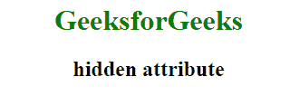
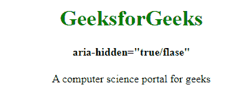

# HTML中`hidden`和`aria-hidden`属性的区别

> 原文：[https://www.geeksforgeeks.org/difference-between-hidden-and-aria-hidden-attributes-in-html/](https://www.geeksforgeeks.org/difference-between-hidden-and-aria-hidden-attributes-in-html/)

超文本标记语言是一种结合了CSS和JavaScript的强大的网络开发工具。除此之外，HTML还使用**可访问的丰富互联网应用程序(ARIA)**使网页内容对残疾人友好。虽然ARIA是有益的，但是HTML和ARIA都有共同的关键词，给业余学习者造成了困惑。

## HTML `hidden`

当某些内容已经过时，不再需要时，使用HTML `hidden`属性。它对用户完全隐藏了细节。它是HTML代码中状态的语义指示器。如果使用此属性，浏览器将不会显示指定了`hidden`属性的元素。隐藏的属性可以使用一些条件或用于查看隐藏内容的JavaScript来查看。

**语法：**

```html
<element hidden>
```

**示例：**

```html
<!DOCTYPE html>
<html>
    <head>
        <title>hidden attribute</title>
        <style>
            body {
                text-align:center;
            }
            h1 {
                color:green;
            }
        </style>
    </head>
    <body>
        <h1>GeeksforGeeks</h1>
        <h2>hidden attribute</h2>
        <!-- hidden paragraph -->
        <p hidden>A computer science portal for geeks</p>
    </body>
</html>
```

**输出：**



## `aria-hidden`

使用`aria-hidden="true"`从辅助功能树中移除元素及其子元素在某些浏览器中是辅助技术，但内容将显示在浏览器中。根据ARIA的第四条规则，不允许在可聚焦元素上使用隐藏特征，因为这会导致用户什么也不聚焦。不要使用`aria-hidden="true"`内的一个`<body>`标记整个页面将无法被辅助技术访问。

**语法：**

```html
<element aria-hidden="true/false">
```

**示例：**

```html
<!DOCTYPE html>
<html>
    <head>
        <title>aria-hidden="true/false"</title>
        <style>
            body {
                text-align:center;
            }
            h1 {
                color:green;
            }
        </style>
    </head>
    <body>
        <h1>GeeksforGeeks</h1>
        <h4>aria-hidden="true/false"</h4>
        <!-- aria-hidden="true" paragraph -->
        <p aria-hidden="true">
            A computer science portal for geeks
        </p>
    </body>
</html>
```



**注意：** `aria-hidden`表示开发人员实现的元素及其所有子元素对任何用户都不可见。

## HTML `hidden`与`aria-hidden`的区别

| HTML `hidden` | `aria-hidden` |
| --- | --- |
| HTML向用户隐藏所有内容。 | ARIA的`aria-hidden`向辅助技术隐藏内容。 |
| 使用HTML `hidden`，可以从浏览器导航中移除可聚焦内容。 | 使用ARIA隐藏时，我们不会从浏览器中移除内容。 |
| 可以应用CSS样式：在HTML中`hidden`的元素不显示。 | ARIA的`aria-hidden`，没有这样的脚本适用。 |