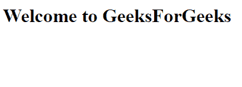

# HTML 和 CSS 的区别

> 原文: [https://www.geeksforgeeks.org/difference-between-html-and-css/](https://www.geeksforgeeks.org/difference-between-html-and-css/)

## HTML

`HTML` 代表超文本标记语言，它是用来定义网页结构的语言。`HTML` 与 `CSS` 和 `JavaScript` 一起用于设计网页。`HTML` 是网站的基本构建块。它具有不同属性和元素，每个元素都有不同的属性。每个元素都有一个开始标签和一个结束标签。我们还可以通过 `HTML` 添加图片。

**示例:**

```html
<html>
<body>
    <h1>Welcome to GeeksForGeeks</h1>
</body>
</html>
```

**输出:**


## CSS

`CSS` 代表层叠样式表，用于样式化网页文档。它用于提供背景颜色，也用于样式设计。它还可以用于设置字体样式并更改其大小。通过 `CSS` 的帮助，我们还可以使用相同的规格来样式化许多不同的网页。`CSS` 也得到万维网联盟（`W3C`）的推荐。它也可以与 `HTML` 和 `JavaScript` 一起用于设计网页。

**示例:**

```html
<html>
<head>
<style>
body {
  background-color:red;
}
</style>
</head>
<body>
<h1>Welcome to GeeksForGeeks!</h1>
<p>This page has red background color</p>
</body>
</html>
```

**输出:**


## HTML 和 CSS 的区别

| 没有 | 超文本标记语言 | 半铸钢ˌ钢性铸铁(Cast Semi-Steel) |
| --- | --- | --- |
| 1. | `HTML` 用于定义网页的结构。 | `CSS` 用于通过使用不同的样式特性来设置网页的样式。 |
| 2. | 它由包含文本的标签组成。 | 它由选择器和声明块组成。 |
| 3. | `HTML` 没有进一步的类型。 | `CSS` 可以是内部的，也可以是外部的，这取决于需求。 |
| 4. | 我们不能在 `CSS` 表单中使用 `HTML`。 | 我们可以在 `HTML` 文档中使用 `CSS`。 |
| 5. | `HTML` 不用于演示和可视化。 | `CSS` 用于表示和可视化。 |
| 6. | `HTML` 的备份和支持相对较少。 | `CSS` 有比较高的备份和支持。 |