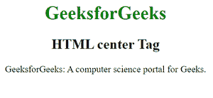
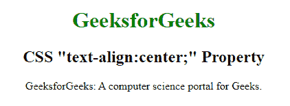

# HTML

## `<center>` 标签与 CSS `text-align: center` 的区别

> 原文: [https://www.geeksforgeeks.org/differences-between-html-center-tag-and-css-text-align-center-property/](https://www.geeksforgeeks.org/differences-between-html-center-tag-and-css-text-align-center-property/)

如果你在设计一个简单的网页，那么没有太大的区别是显而易见的，但是了解这两者之间的基本区别是非常必要的。由于我们只关注文本，这些元素没有单独的含义。

### HTML `<center>` 标签

HTML 中的 `<center>` 标签用于设置文本的居中对齐。`HTML 5` 不支持这个标签。`CSS` 属性用于设置元素的对齐方式，而不是 `HTML 5` 中的中心标记。它是一个块级元素，用于水平显示标签中的文本。大多数常见的浏览器，如谷歌 `Chrome`、`Mozilla Firefox`、互联网浏览器都支持这个标签。

*   **示例:** 下面的代码在 `HTML 4` 和更早的版本中用于将文本居中对齐。

```html
<!DOCTYPE html>
<html>
<head>
    <style>
        h1 {
            color: green;
        }
    </style>
</head>
<body>
    <center>
        <h1>GeeksforGeeks</h1>
        <h2>HTML center Tag</h2>
        <p>
            GeeksforGeeks: A computer science portal for Geeks.
        </p>
    </center>
</body>
</html>
```

*   **输出:**
    

### CSS `text-align: center;` 属性

`text-align: center;` 是一个用来居中对齐文本的 `CSS` 属性，可以用在很多组件中，包括表格、按钮等。

*   **示例:** 实现 `text-align: center` 属性如下:

```html
<!DOCTYPE html>
<html>
<head>
    <title>
        text-align: center property
    </title>
    <style>
        h1 {
            color:green;
        }
    </style>
</head>
<body>
    <h1 style="text-align:center;">
        GeeksforGeeks
    </h1>
    <h2 style="text-align:center;">
        CSS "text-align:center;" Property
    </h2>
    <p style="text-align:center;">
        GeeksforGeeks:
        A computer science portal for Geeks.
    </p>
</body>
</html>
```

*   **输出:**
    

您可以注意到两个输出是相同的，但是在 `HTML5` 代码的情况下，我们使用内联 `CSS` 将文本对齐到中心。在之前的 `HTML4` 和旧版本的代码中，我们特别使用了 `<center>` 标签。

### HTML `<center>` 标签与 CSS `text-align: center;` 属性的区别

| HTML `<center>` 标签 | CSS `text-align: center;` 属性 |
| --- | --- |
| HTML `<center>` 标签是块级元素。 | CSS `text-align: center;` 属性是内联元素。 |
| 它最适合附加到网页的某个特定部分。 | 它最适合粘贴在网页中一行短段落上。 |
| `HTML 5` 不支持 `<center>` 标签，未来的 `HTML` 版本也不支持它。 | `HTML 5` 支持 `text-align: center` 属性，未来的 `HTML` 版本也将支持它。 |
| 此标签应用于包裹一个部分并使该部分居中。 | 此属性应用于包装任何您想在网页中居中的特定词语。 |