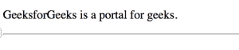
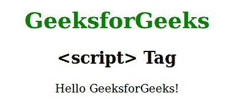

# HTML 页面头部使用的元素

> 原文：[https://www.geeksforgeeks.org/elements-that-are-used-in-head-section-of-html-page/](https://www.geeksforgeeks.org/elements-that-are-used-in-head-section-of-html-page/)

元素就像一个元数据的容器，即关于数据的数据，它也位于`<head>`标签和`</head>`标签之间。元数据是关于 HTML 文档的数据，不显示在网页上。它定义了文档标题、样式、脚本和其他元信息。

HTML `<head>`元素是以下元素的容器：`<title>`、`<link>`、`<meta>`、`<base>`、`<style>`、`<script>`等。

## `<title>` 元素

`<title>`元素定义了网页的标题。标题必须是文本，我们将能够在浏览器的页面标签中看到标题。

**为什么使用：**

搜索引擎使用页面标题来决定在搜索结果中列出页面的顺序。所以，使用有意义和准确的标题有助于你通过搜索引擎优化排名更好。

```html
<!DOCTYPE html>
<html lang="en">

<head>
    <title>HTML Head Tag </title>
</head>

<body>
    <p>GeeksforGeeks is a portal for geeks.</p>
    <hr>
</body>

</html>
```

**输出：**


## `<link>` 元素

`<link>`标签最常用于链接外部 CSS 文件。它定义了当前文档与外部资源之间的关系。

```html
<!DOCTYPE html>
<html>

<head>
    <link rel="stylesheet" type="text/css" href="mystyle.css">
</head>

<body>
    <h1>GeeksforGeeks</h1>
    <p>It is a portal for geeks.</p>
</body>

</html>
```

**输出：**


## `<meta>` 元素

`<meta>`元素用于指定字符集、页面描述、关键词、文档作者和视口设置。元数据不会显示，但会被浏览器用于决定如何显示内容或重新加载页面，也会被搜索引擎和其他网络服务使用。

```html
<!DOCTYPE html>
<html>
    <head>
        <title>meta tag examples</title>
        <meta name="keywords" content="Meta Tags, Metadata"/>
    </head>

<body>
        <p>Hello GeeksforGeeks!</p>
    </body>
</html>
```

**输出：**
```
Hello GeeksforGeeks!
```

## `<base>` 元素

`<base>`元素用于为相对网址指定基本网址或目标。一个文档中只能有一个`<base>`元素。

```html
<!DOCTYPE html>
<html>

<head>
    <!-- Declaring the BASE URL -->
    <base href="https://media.geeksforgeeks.org/wp-content/uploads/" target="_blank">
</head>

<body>
    
</body>

</html>
```

**输出：**


## `<style>` 元素

`<style>`元素用于在我们的 HTML 网页中制作内部 CSS。我们可以使用各种属性及其值来修改文本和网页视图。一些属性包括`background-color`、`text-align`等。

```html
<!DOCTYPE html>
<html>

<head>
    <style>
        body {
            background: skyblue;
        }
        h1 {
            color: red;
        }
        p {
            color: blue;
        }
    </style>
</head>

<body>
    <h1>GeeksforGeeks</h1>
    <p>It is a portal for geeks.</p>
</body>

</html>
```

**输出：**


## `<script>` 元素

`<script>`元素用于在 HTML 网页中定义脚本。

例如，下面的 JavaScript 代码将“GeeksforGeeks”写入一个`id`为`"demo"`的 HTML 元素中。

```html
<!DOCTYPE html>
<html>
    <head>
        <title>script tag</title>
        <style>
            body {
                text-align:center;
            }
            h1 {
                color:green;
            }
        </style>
    </head>
    <body>
        <h1>GeeksforGeeks</h1>
        <h2><script> Tag</h2>
        <p id="Geeks"></p>
        <script>
            document.getElementById("Geeks").innerHTML = "Hello GeeksforGeeks!";
        </script>
    </body>
</html>
```

**输出：**
