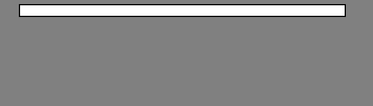
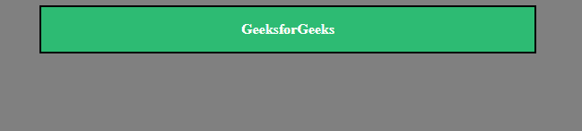
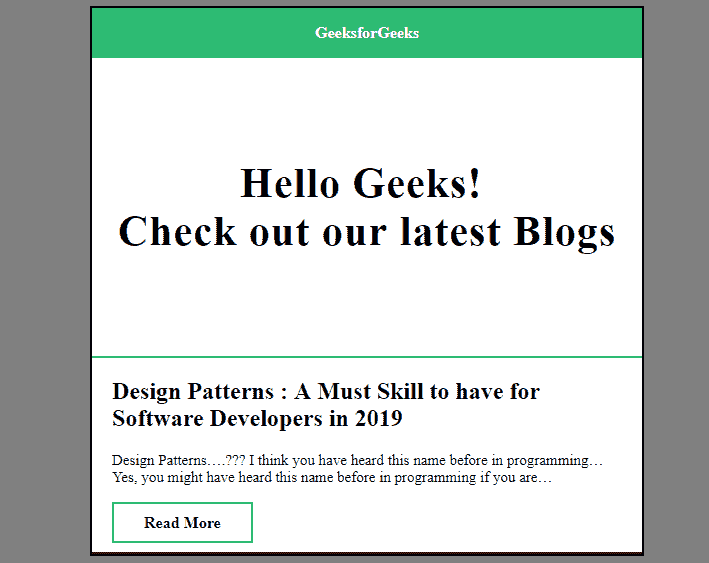
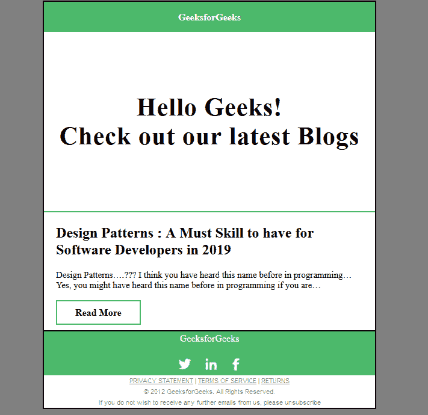

# 使用 HTML 和 CSS 的邮件模板

> 原文：[https://www.geeksforgeeks.org/email-template-using-html-and-css/](https://www.geeksforgeeks.org/email-template-using-html-and-css/)

你有没有想过如何发送富有创意的彩色电子邮件模板？在本文中，我们将使用 HTML 和 CSS 创建一个基本的电子邮件模板。这些电子邮件模板通常是为营销目的而设计的，并通过电子邮件活动进行传播。

发送电子邮件模板的主要目的是获得行动号召（CTA）的数量。电子邮件模板的创造性设计吸引了客户，可以在所需的目标页面上获得更多的 CTA。

## 创建样本模板

根据所需的大纲发送电子邮件可能非常具有挑战性。这是因为不同的浏览器拥有不同的配置，因此父 CSS 属性也不同。例如，通过 Gmail 发送电子邮件时，`display: absolute` 属性不起作用。

同样，在编写电子邮件模板时，也很少需要采取其他预防措施。从电子邮件模板开始的第一步也是最重要的一步是，必须使用 HTML 表来构建电子邮件模板的基本结构。

创建表格可确保发送的内容在使用不同的电子邮件应用程序转发或邮寄时不会失真。

### 示例：开始

```html
<!-- Create main outline within which email will be enclosed -->

<body style="background-color:grey">
    <table align="center" border="0" cellpadding="0" cellspacing="0" 
           width="550" bgcolor="white" style="border:2px solid black">
        <tbody>
            <tr>
                <td align="center">
                    <br />
                    <table align="center" border="0" cellpadding="0"
                           cellspacing="0" class="col-550" width="550">
                        <tbody>
                            <!-- content goes here -->
                        </tbody>
                    </table>
                </td>
            </tr>
        </tbody>
    </table>
</body>
```



现在，请记住，电子邮件应用程序将只支持内嵌样式。如果您在样式标签中指定属性，电子邮件应用程序将不会考虑它们，并且指定的属性也不会被应用。

### 例：

```html
<body style="background-color:grey">
    <table align="center" border="0" cellpadding="0" cellspacing="0" 
           width="550" bgcolor="white" style="border:2px solid black">
        <tbody>
            <tr>
                <td align="center">
                    <table align="center" border="0" cellpadding="0" 
                           cellspacing="0" class="col-550" width="550">
                        <tbody>
                            <tr>
                                <td align="center" 
                                    style="background-color: #4cb96b;
                                           height: 50px;">

<a href="#" style="text-decoration: none;">
                                        <p style="color:white;font-weight:bold;">
                                            GeeksforGeeks
                                        </p>
                                    </a>
                                </td>
                            </tr>
                        </tbody>
                    </table>
                </td>
            </tr>
        </tbody>
    </table>
</body>
```



可以使用 `<tr>` 和 `<td>` 标签制作更多部分。现在，让我们输入进一步的信息。

### 例：

```html
<!-- Complete Email template -->

<body style="background-color:grey">
    <table align="center" border="0" cellpadding="0" cellspacing="0"
           width="550" bgcolor="white" style="border:2px solid black">
        <tbody>
            <tr>
                <td align="center">
                    <table align="center" border="0" cellpadding="0" 
                           cellspacing="0" class="col-550" width="550">
                        <tbody>
                            <tr>
                                <td align="center" style="background-color: #4cb96b;
                                           height: 50px;">

<a href="#" style="text-decoration: none;">
                                        <p style="color:white;
                                                  font-weight:bold;">
                                            GeeksforGeeks
                                        </p>
                                    </a>
                                </td>
                            </tr>
                        </tbody>
                    </table>
                </td>
            </tr>
            <tr style="height: 300px;">
                <td align="center" style="border: none;
                           border-bottom: 2px solid #4cb96b; 
                           padding-right: 20px;padding-left:20px">

<p style="font-weight: bolder;font-size: 42px;
                          letter-spacing: 0.025em;
                          color:black;">
                        Hello Geeks!
                        <br> Check out our latest Blogs
                    </p>
                </td>
            </tr>

<tr style="display: inline-block;">
                <td style="height: 150px;
                           padding: 20px;
                           border: none; 
                           border-bottom: 2px solid #361B0E;
                           background-color: white;">

<h2 style="text-align: left;
                               align-items: center;">
                        Design Patterns : A Must Skill to 
                      have for Software Developers in 2019
                   </h2>
                    <p class="data" 
                       style="text-align: justify-all;
                              align-items: center; 
                              font-size: 15px;
                              padding-bottom: 12px;">
                        Design Patterns….??? I think you have heard this name 
                      before in programming… Yes, you might have heard 
                      this name before in programming if you are…
                    </p>
                    <p>
                        <a href=
"https://www.geeksforgeeks.org/design-patterns-a-must-skill-to-have-for-software-developers-in-2019/"
                           style="text-decoration: none; 
                                  color:black; 
                                  border: 2px solid #4cb96b; 
                                  padding: 10px 30px;
                                  font-weight: bold;"> 
                           Read More 
                      </a>
                    </p>
                </td>
            </tr>
        </tbody>
    </table>
</body>
```



## 最后，您可能会添加一个页脚

最后，您可能会添加一个页脚，其中包含社交媒体链接、公司名称、联系信息等。

### 例：

```html
<!-- Complete Email template -->

<body style="background-color:grey">
    <table align="center" border="0" cellpadding="0" cellspacing="0"
           width="550" bgcolor="white" style="border:2px solid black">
        <tbody>
            <tr>
                <td align="center">
                    <table align="center" border="0" cellpadding="0"
                           cellspacing="0" class="col-550" width="550">
                        <tbody>
                            <tr>
                                <td align="center" style="background-color: #4cb96b;
                                           height: 50px;">

<a href="#" style="text-decoration: none;">
                                        <p style="color:white;
                                                  font-weight:bold;">
                                            GeeksforGeeks
                                        </p>
                                    </a>
                                </td>
                            </tr>
                        </tbody>
                    </table>
                </td>
            </tr>
            <tr style="height: 300px;">
                <td align="center" style="border: none;
                           border-bottom: 2px solid #4cb96b; 
                           padding-right: 20px;padding-left:20px">

<p style="font-weight: bolder;font-size: 42px;
                          letter-spacing: 0.025em;
                          color:black;">
                        Hello Geeks!
                        <br> Check out our latest Blogs
                    </p>
                </td>
            </tr>

<tr style="display: inline-block;">
                <td style="height: 150px;
                           padding: 20px;
                           border: none; 
                           border-bottom: 2px solid #361B0E;
                           background-color: white;">
```

# Design Patterns : A Must Skill to have for Software Developers in 2019

Design Patterns….??? I think you have heard this name before in programming… Yes, you might have heard this name before in programming if you are…

[Read More](https://www.geeksforgeeks.org/design-patterns-a-must-skill-to-have-for-software-developers-in-2019/)

GeeksforGeeks

[](#) [](#) [](#)

[PRIVACY STATEMENT](#) | [TERMS OF SERVICE](#) | [RETURNS](#)
© 2012 GeeksforGeeks. All Rights Reserved.
If you do not wish to receive any further emails from us, please [unsubscribe](#)



这样，您可以创建许多漂亮的模板。虽然用 `divs` 编写电子邮件代码会更容易、更快，但是如果使用 `divs` 编写代码，就会有很多问题。此外，使用 `table` 和 `table row` 对结构进行编码既简单又有趣。