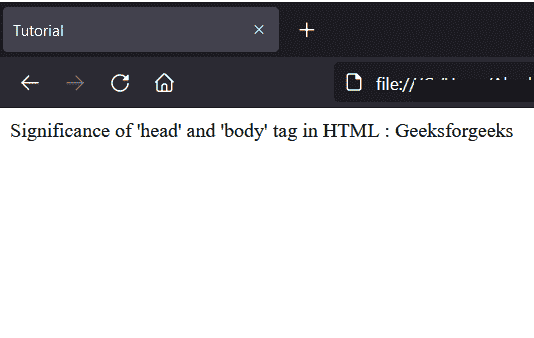
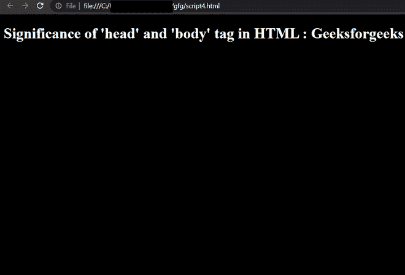

# 解释 HTML 中 `<head>` 和 `<body>` 标签的意义

> 原文: [https://www.geeksforgeeks.org/explain-the-significance-of-head-and-body-tag-in-html/](https://www.geeksforgeeks.org/explain-the-significance-of-head-and-body-tag-in-html/)

HTML 中最常用的两个标签是 `<head>` 和 `<body>` 标签。很少能找到一个行业级网站不在页面中使用 `<head>` 和 `<body>` 标签的。在本文中，我们将学习这两个标签在 HTML 文档中的意义。

## HTML `<head>` 标签的意义

HTML 中的 `<head>` 标签用于包含与文档相关的元数据或信息。它持有一些最重要的标签，如 `<title>`、`<meta>` 以及 `<link>`。

### 从浏览器角度

*   在 HTML 5 中，不强制在 HTML 文档中包含 `<head>` 标签，但是在以前的版本(4.0.1)中，它是强制包含的。
*   像 `<title>`、`<meta/>` 或 `<link/>` 这样的标签通常包含在 `<head>` 内部，没有 `<head>` 标签或在 `<head>` 标签外部也能正常工作。

### 从发展角度来看

*   从开发人员的角度来看，在文档中包含 `<head>` 标签是很好的，因为这种语法被广泛使用，并且它也为文档提供了一个良好的结构。稍后，这将帮助我们以结构化的方式与 DOM 元素进行交互。

## HTML `<body>` 标签的意义

HTML `<body>` 标签是 `<html>` 标签的最后一个子标签。它用于包含 HTML 文档的主要内容。它保存了从标题、段落到独特的 `<div>` 容器的所有内容，这些容器位于 `<body>` 标签内。

### 从浏览器角度

*   在 HTML 5 中，不强制在 HTML 文档中包含 `<body>` 标签，但是在以前的版本(4.0.1)中，它是强制包含的。
*   像 `<h1>`、`<p>` 或 `<a>` 这样的标签一般包含在 `<body>` 内部，没有 `<body>` 标签或在 `<body>` 标签之外也能正常工作。
*   尽管不是强制性的，`<body>` 标签有一些属性，如 `background`、`bgcolor`、`alink`、`link` 等。

### 从开发的角度

从开发人员的角度来说，在文档里面加入 `<body>` 标签就好了。这种语法被广泛使用，它也为文档提供了良好的结构。稍后，这将帮助我们以结构化的方式与 DOM 元素进行交互。

### 例 1

以下代码没有 `<head>` 和 `<body>` 标签。

```html
<!DOCTYPE html>
<html>
    <p>
        Significance of 'head' and 'body' 
        tag in HTML : Geeksforgeeks
    </p>

<title>Tutorial</title>
</html>
```

**输出:**



### 示例 2

以下代码将 `<head>` 和 `<body>` 标记添加到文档中。即使包含 `<head>` 和 `<body>` 标签，最后一个中的输出也是一样的，但是它给出了更好的代码结构和更好的理解角度。

```html
<!DOCTYPE html>
<html>

<head>
    <title>Tutorial</title>
</head>

<body>
    <p>
        Significance of 'head' and 'body'
        tag in HTML : Geeksforgeeks
    </p>
</body>

</html>
```

**输出:**


我们可以清楚地看到，输出没有变化。但是随着惯例的正确遵守，我们很容易理解代码。

### 示例 3

下面的代码使用了 `<body>` 标签的属性。在本例中，我们将使用 `<body>` 标签的 `bgcolor` 属性。它将改变整个文档的背景颜色。没有了 `<body>` 标签，我们会失去更多类似 `<alink>`、`<link>` 等属性。

```html
<!DOCTYPE html>
<html>

<head>
    <title>Tutorial</title>
    <link rel="stylesheet" href="styles.css">
</head>

<body bgcolor="black">
    <h1>
        Significance of 'head' and 'body' 
        tag in HTML : Geeksforgeeks
    </h1>
</body>

</html>
```

**输出:**

