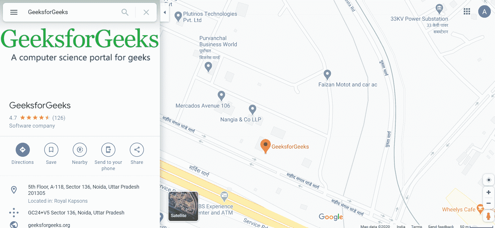
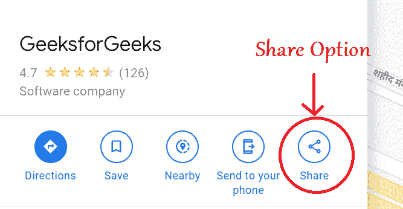
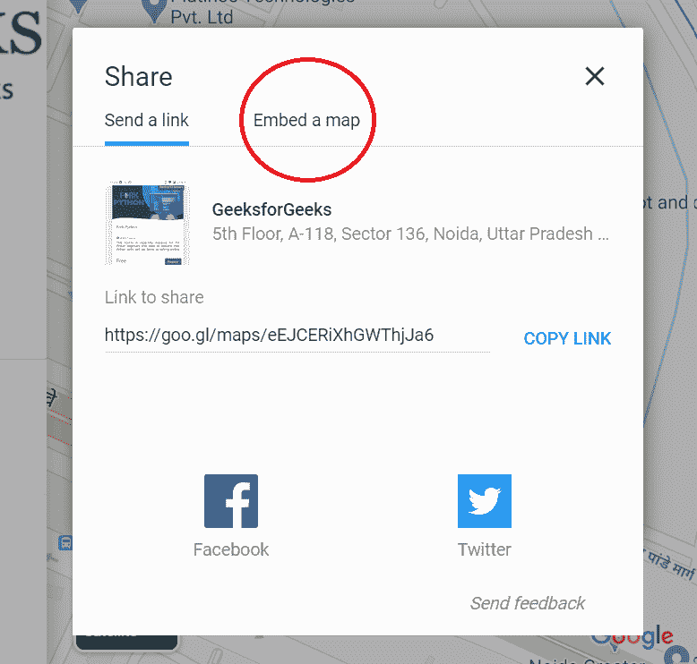
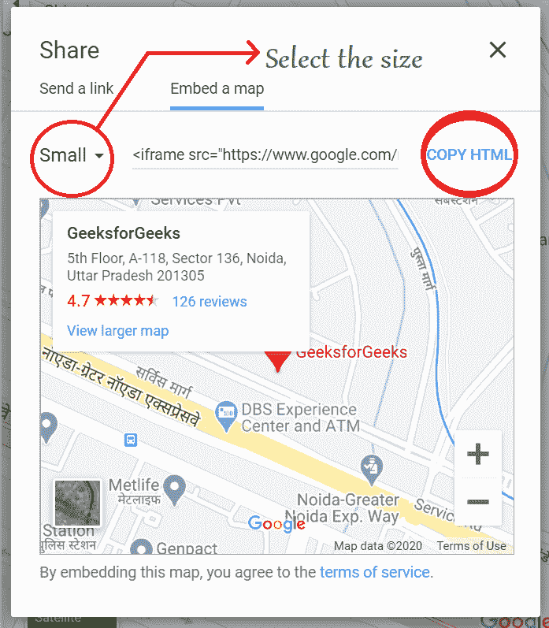
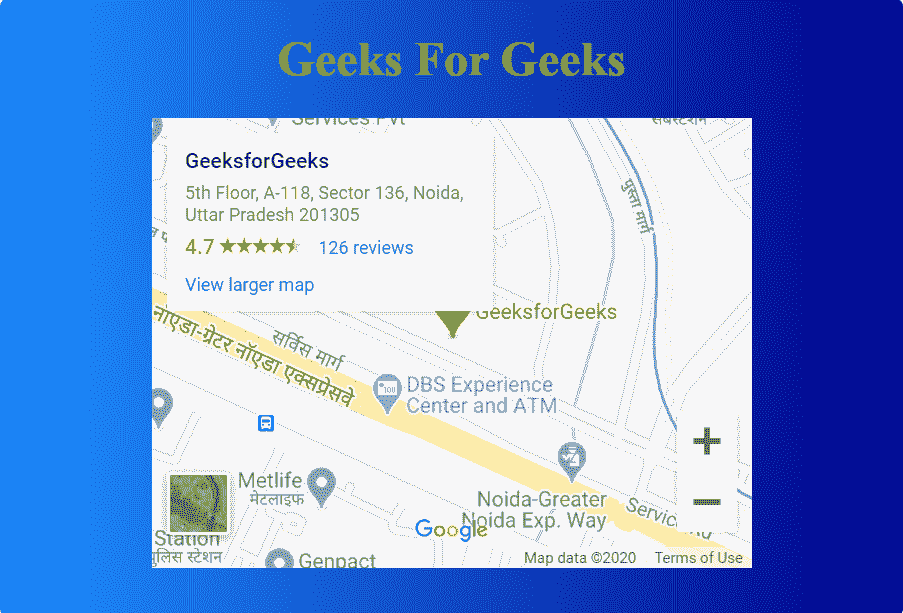

# 如何在 HTML 页面内部不使用 API 键添加谷歌地图？

> 原文：[https://www.geeksforgeeks.org/how-to-add-google-map-inside-html-page-without-using-api-key/](https://www.geeksforgeeks.org/how-to-add-google-map-inside-html-page-without-using-api-key/)

## 引言
在 HTML 页面中添加谷歌地图有两种方法：
1. 使用 API 密钥
2. 不使用 API 密钥

要学习第一种情况，您可以遵循[这篇文章](https://www.geeksforgeeks.org/add-google-maps-marker-website/)，而要学习另一种情况，请遵循本文。

## 步骤
要在 HTML 页面中插入谷歌地图，请执行以下步骤：

1.  前往谷歌地图并搜索您想要的位置。
    

2.  现在，您将看到“分享”选项，点击它。
    

3.  然后，会出现一个对话框，转到“嵌入地图”选项。
    

4.  对话框内将出现一个新选项“复制 HTML”。您还可以选择要嵌入到页面中的地图尺寸。
    

5.  现在把它粘贴到您的 HTML 页面中。

## 示例
如何在 HTML 页面内部不使用 API 键添加谷歌地图。

```html
<!DOCTYPE html>
<html>

<head>
    <meta charset="utf-8">
    <title>Customize the scroll-bar</title>

    <style media="screen">
        body {
            background-image: linear-gradient(
                to right, dodgerblue, darkblue);
        }
    </style>
</head>

<body>
    <center>
        <h1 style="color:lawngreen;">
            Geeks For Geeks
        </h1>

        <div>
            <!-- Google Map Copied Code -->
            <iframe src="https://www.google.com/maps/embed?pb=!1m18!1m12!1m3!1d3506.2233913121413!2d77.4051603706222!3d28.50292593193056!2m3!1f0!2f0!3f0!3m2!1i1024!2i768!4f13.1!3m3!1m2!1s0x390ce626851f7009%3A0x621185133cfd1ad1!2sGeeksforGeeks!5e0!3m2!1sen!2sin!4v1585040658255!5m2!1sen!2sin"
                width="400"
                height="300"
                frameborder="0"
                style="border:0;"
                allowfullscreen=""
                aria-hidden="false"
                tabindex="0">
            </iframe>
        </div>
    </center>
</body>

</html>
```

**输出：**


## 注意
这个技术的问题是没有使用 API，所以地图没有自动更新，因此每次都需要通过改变地图的 HTML 代码来手动更新地图。