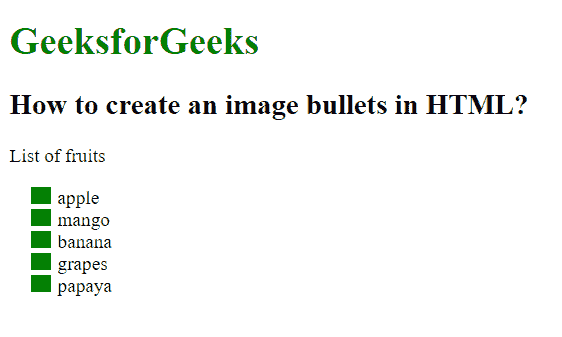

# 如何在 HTML 中创建图像项目符号？

> 原文：[https://www.geeksforgeeks.org/how-to-create-an-image-bullets-in-html/](https://www.geeksforgeeks.org/how-to-create-an-image-bullets-in-html/)

在本文中，我们给出了一些列表项，任务是创建一个带有图像项目符号的列表项。这个任务可以通过使用 CSS 中的 `list-style-image` 属性来完成。此属性用于设置将用作列表项标记的图像。

## 语法

```css
list-style-image: url;
```

## 示例

下面的代码说明了如何使用 CSS 创建图像项目符号。

```html
<!DOCTYPE html>
<html>
<head>
    <title>
        How to create an image bullets in HTML?
    </title>
    <style>
        ul {
            list-style-image: url("https://contribute.geeksforgeeks.org/wp-content/uploads/listitem-1.png");
        }
    </style>
</head>
<body>
    <h1 style="color:green;">
        GeeksforGeeks
    </h1>
    <h2>
        How to create an image bullets in HTML?
    </h2>
    <p>List of fruits</p>
    <ul>
        <li>apple</li>
        <li>mango</li>
        <li>banana</li>
        <li>grapes</li>
        <li>papaya</li>
    </ul>
</body>
</html>
```

## 输出



## 支持的浏览器

* `Google Chrome`
* `Microsoft Edge`
* `Firefox`
* `Safari`
* `Opera`