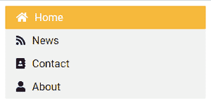

# 如何使用 HTML 和 CSS 创建垂直导航栏？

> 原文：[https://www.geeksforgeeks.org/how-to-create-vertical-navigation-bar-using-html-and-css/](https://www.geeksforgeeks.org/how-to-create-vertical-navigation-bar-using-html-and-css/)

看完这篇文章，你将能够建立自己的垂直导航栏。要阅读这篇文章，你只需要对 HTML 和 CSS 有一些基本的了解。

让我们开始编写我们的垂直导航栏。首先，我们将编写导航栏的结构。在本教程中，我们使用一个 HTML 列表项来创建导航栏。我们在导航栏中使用 `font-awesome 5` 图标。为此，在 `<head>` 标签之后，我们添加了 `<script>` 标签，以包括 `font-awesome` 库。

## HTML

```html
<!DOCTYPE html>
<html>

<head>
    <script src=
"https://kit.fontawesome.com/a076d05399.js">
    </script>
</head>

<body>
    <ul>
        <li>
            <a href="#" class="active">
                <i class="fas fa-home icon"></i>
                Home
            </a>
        </li>
        <li><a href="#">
                <i class="fas fa-rss icon"></i>
                News
            </a>
        </li>
        <li><a href="#">
                <i class="fas fa-address-book icon"></i>
                Contact
            </a>
        </li>
        <li><a href="#"><i class="fas fa-user icon"></i>
                About
            </a>
        </li>
    </ul>
</body>

</html>
```

我们已经使用 HTML 定义了网页的结构。现在我们需要使用 CSS 属性添加一些样式。

## CSS

首先，从列表中删除项目符号、边距和填充。现在给出背景颜色和特定宽度。

```html
<style>
  ul {
    list-style-type: none;
    margin: 0;
    padding: 0;
    width: 300px;
    background-color: #f1f1f1;
  }
</style>
```

*   `list-style-type: none;` 属性从 HTML 列表中删除项目符号。
*   `margin: 0;` 和 `padding: 0;` 从元素中移除浏览器默认边距和填充。

为了创建一个垂直导航栏，你必须在列表中设置链接的样式。

```html
<style>
  li a {
    display: block;
    color: #000;
    padding: 8px 16px;
    text-decoration: none;
  }

  /* color change on hover */
  li a:hover {
    background-color: #fad390;
    color: #fff;
  }
</style>
```

*   `display: block;` 像块元素一样显示链接的属性使链接区域可点击。它允许我们指定宽度（填充、边距、高度等）。
*   `padding: 8px 16px` 顶部和底部填料为 8px。左右划水均为 16px。
*   `text-decoration: none;` 删除 `<a>` 元素的下划线。

### 图标样式

```html
<style>
  .icon {
    margin-right: 10px;
  }
</style>
```

*   `margin-right: 10px` 它在文本和图标之间增加了一些空白。

**最终代码：** 以下是上述所有代码片段的组合。

## 最终代码

```html
<!DOCTYPE html>
<html>
<head>
    <title>Page Title</title>
     <script src="
     https://kit.fontawesome.com/a076d05399.js">
    </script>
    <style>
      ul {
        list-style-type: none;
        margin: 0;
        padding: 0;
        width: 300px;
        background-color: #f1f1f1;
      }
      li a {
        display: block;
        color: #000;
        padding: 8px 16px;
        text-decoration: none;
      }

      /* Change the link color on hover */
      li a:hover {
        background-color: #fad390;
        color: #fff;
      }
      .icon {
        margin-right: 10px;
      }
  </style>
</head>
<body>
    <ul>
        <li><a href="#" class="active">
           <i class="fas fa-home icon"></i>
          Home</a></li>
        <li><a href="#">
           <i class="fas fa-rss icon"></i>
          News</a></li>
        <li><a href="#">
          <i class="fas fa-address-book icon"></i>
          Contact</a></li>
        <li><a href="#">
          <i class="fas fa-user icon"></i>
        About</a></li>
    </ul>
</body>
</html>
```

**输出：**

