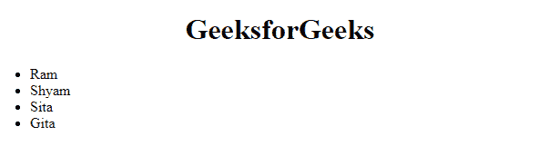

# 如何从 JavaScript 数组创建 HTML 列表？

> 原文: [https://www.geeksforgeeks.org/how-to-creating-html-list-from-javascript-array/](https://www.geeksforgeeks.org/how-to-creating-html-list-from-javascript-array/)

在本文中，我们将从一个 JavaScript 数组创建一个 HTML 列表。当我们从任何来源获取 JSON 并将数据显示到前端时，有时需要这样做，在许多其他情况下也是如此。

## 问题陈述

将数组 `['Ram', 'Shyam', 'Sita', 'Gita']` 显示成一个 HTML 列表。

为此，我们将遵循以下步骤。

## 第一步：创建 HTML 骨架

```html
<!DOCTYPE html>
<html>
  <head> </head>
  <body>
    <center><h1>GeeksforGeeks</h1></center>
    <ul id="myList"></ul>
  </body>
</html>
```

## 第二步：创建变量

创建一个名为 `list` 的变量，获取 id 为 `myList` 的元素。

```javascript
let list = document.getElementById("myList");
```

## 第三步：迭代数组并创建列表项

现在使用 JavaScript [`forEach`](https://www.geeksforgeeks.org/javascript-array-foreach-method/) 迭代所有数组项，在每次迭代时，创建一个 `li` 元素，并将 `innerText` 值与当前项相同，并将 `li` 追加到列表中。

```javascript
let data = ['Ram', 'Shyam', 'Sita', 'Gita' ];

let list = document.getElementById("myList");

data.forEach((item)=>{
  let li = document.createElement("li");
  li.innerText = item;
  list.appendChild(li);
})
```

## 完整代码

```html
<!DOCTYPE html>
<html>
  <head> </head>
  <body>
    <center><h1>GeeksforGeeks</h1></center>
    <ul id="myList"></ul>
    <script>
      let data = ["Ram", "Shyam", "Sita", "Gita"];
      let list = document.getElementById("myList");
      data.forEach((item) => {
        let li = document.createElement("li");
        li.innerText = item;
        list.appendChild(li);
      });
    </script>
  </body>
</html>
```

## 输出

