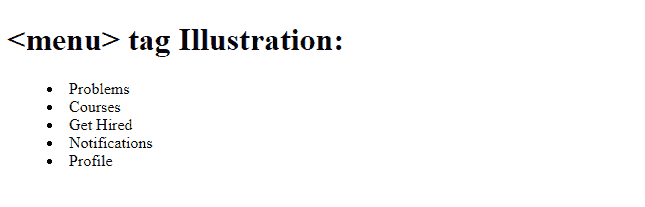
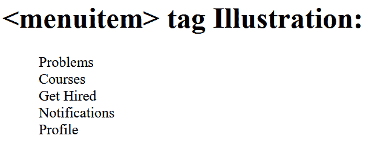

# 如何在 HTML5 中定义命令列表或菜单？

> 原文：[https://www.geeksforgeeks.org/how-to-define-a-list-or-menu-of-commands-in-html5/](https://www.geeksforgeeks.org/how-to-define-a-list-or-menu-of-commands-in-html5/)

`<menu>` 标签用于定义 HTML5 中的命令列表或菜单。它可以包含一个以上的 `<li>` 或 `<menuitem>` 元素。

`<menu>` 标签只有最新的 Mozilla Firefox 网络浏览器才支持。这个标签也支持 HTML5 中的[事件](https://www.geeksforgeeks.org/html-event-attributes-complete-reference/)属性。

## 语法

## 示例

以下示例演示了 `<menu>` 标签与 `<li>` 标签一起定义列表的类型。

```html
<!DOCTYPE html>
<html>
  <body>
    <h1><menu> tag Illustration:</h1>
    <menu>
      <li>Problems</li>
      <li>Courses</li>
      <li>Get Hired</li>
      <li>Notifications</li>
      <li>Profile</li>
    </menu>
  </body>
</html>
```

**输出：**



**注意：** 使用 Mozilla Firefox 网络浏览器进行输出。

## 示例 2

以下示例演示了使用带有 `<menuitem>` 标签的 `<menu>` 来显示项目。

最新版本的 HTML 即 HTML5 不支持 `<menuitem>` 标签。建议使用以前的版本进行输出。

### 语法

```html
<menu>
   <menuitem> </menuitem>
</menu>
```

```html
<!DOCTYPE html>
<html>
  <body>
    <h1><menuitem> tag Illustration:</h1>
    <menu>
      <menuitem>Problems</menuitem>
      <menuitem>Courses</menuitem>
      <menuitem>Get Hired</menuitem>
      <menuitem>Notifications</menuitem>
      <menuitem>Profile</menuitem>
    </menu>
  </body>
</html>
```

**输出：**



**注意：** 使用 Mozilla Firefox 网络浏览器进行输出。