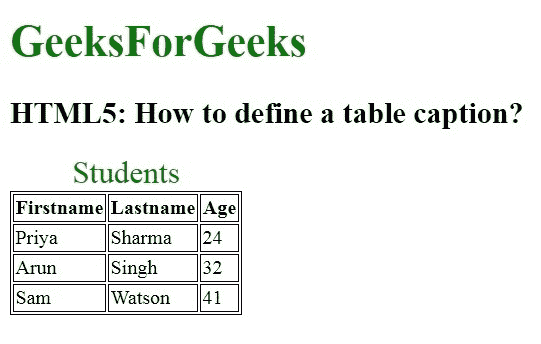

# 如何用 HTML 定义表格标题？

> 原文：[https://www.geeksforgeeks.org/how-to-define-a-table-caption-using-html/](https://www.geeksforgeeks.org/how-to-define-a-table-caption-using-html/)

## 介绍

在本文中，我们通过使用 [`<caption>` 标记](https://www.geeksforgeeks.org/html-caption-tag/) 元素来定义表格标题。`caption` 元素用于指定表格的标题。该标记将被插入到 `<table>` 标签之后。一个表格只能指定一个标题。它默认居中对齐。

## 语法

```html
<caption align="value"> </caption>
```

## 示例

```html
<!DOCTYPE html>
<html>

<head>
    <style>
        table,
        th,
        td {
            border: 1px solid black;
        }

        #GFG {
            font-size: 25px;
            color: green;
        }
    </style>
</head>

<body>
    <h1 style="color:green;font-size:35px;">
        GeeksForGeeks
    </h1>

    <h2>
        HTML5: How to define 
        a table caption?
    </h2>

    <table>

        <!-- Adding caption to the table -->
        <caption id="GFG">Students</caption>
        <tr>
            <th>Firstname</th>
            <th>Lastname</th>
            <th>Age</th>
        </tr>
        <tr>
            <td>Priya</td>
            <td>Sharma</td>
            <td>24</td>
        </tr>
        <tr>
            <td>Arun</td>
            <td>Singh</td>
            <td>32</td>
        </tr>
        <tr>
            <td>Sam</td>
            <td>Watson</td>
            <td>41</td>
        </tr>
    </table>
</body>

</html>
```

## 输出



## 支持的浏览器

*   `Google Chrome`
*   `Microsoft Edge`
*   `Firefox`
*   `Opera`
*   `Safari`