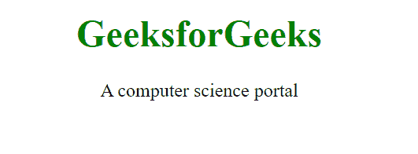

# 如何用 HTML 定义文档的相关信息？

> 原文：[https://www.geeksforgeeks.org/how-to-define-information-about-the-document-using-html/](https://www.geeksforgeeks.org/how-to-define-information-about-the-document-using-html/)

HTML 中的 `<head>` 标签用于定义包含与文档相关的元数据的文档头部。该标签可以包含其他头部元素，如 `<title>`、`<meta/>`、`<link/>`、`<style>`、`<link>` 等。

`<head>` 元素在 HTML 4.01 中是强制的，但在当前的 HTML 5 中可以省略。

## 语法：

```html
<head>
    <title>Title of the document</title>
</head>
```

## 属性：

*   `profile`：用于指定包含一个或多个元数据配置文件的文档的网址，以便浏览器清楚地了解信息。

## 例 1：

```html
<!DOCTYPE html>
<html>
<head>
    <title>
        How to define information about
        the document using HTML?
    </title>
</head>
<body style="text-align: center;">
    <h1 style="color: green;">
        GeeksforGeeks
    </h1>
    <p>
        A computer science portal
    </p>
</body>
</html>
```

**输出：**



## 例 2：

在本例中，使用 `<link>` 标签链接了一个名为 `style.css` 的 CSS 样式表。

**CSS 文件：**

```css
body {
 text-align: center;
}
h1 {
 color: green;
}
```

**HTML 文件：**

```html
<!DOCTYPE html>
<html>
<head>
    <title>
        How to define information about
        the document using HTML?
    </title>
    <link rel="stylesheet" href="style.css">
</head>
<body>
    <h1>GeeksforGeeks</h1>
    <p>
        A computer science portal
    </p>
</body>
</html>
```

**输出：**


## 支持的浏览器：

*   谷歌 Chrome
*   微软公司出品的 web 浏览器
*   火狐浏览器
*   歌剧
*   旅行队