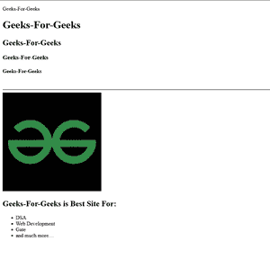

# 如何在 HTML5 中定义文档的正文？

> 原文：[https://www.geeksforgeeks.org/how-to-define-the-documents-body-in-html5/](https://www.geeksforgeeks.org/how-to-define-the-documents-body-in-html5/)

HTML5 中的文档正文由 `<body>` 标签定义，该标签放置在 `<html>` 标签中并位于 `<head>` 标签之后。
`<body>` 标签可以包括：

*   **标题标签：** `<h1>`、`<h2>`、`<h3>` 等等。
*   **段落标记：** `<p>`
*   **断线标记：** `<br>`
*   **横线标记：** `<hr>`
*   **图像和视频标签：** ``、`<video>`
*   **列表标签：** `<ul>` 和 `<ol>`
*   **表标签：** `<table>`

`<body>` 标签包含了如此多的其他标签，网页上所有重要的信息，或者有人可以说它是网页的骨架。

**示例：** 下面的示例说明了 `body` tag 的使用。

```html
<!DOCTYPE html>
<html lang="en">
<head>
  <title>
    Geeks-For-Geeks
  </title>
</head>
<body>
  <!-- Paragraph Tag-->
  <p>Geeks-For-Geeks</p>

<!--H1 Tag--> 
  <h1>Geeks-For-Geeks</h1>

<!--H2 Tag-->
  <h2>Geeks-For-Geeks</h2>

<!--H3 Tag-->
  <h3>Geeks-For-Geeks</h3>

<!--H4 Tag-->
  <h4>Geeks-For-Geeks</h4>

<!--Line Break Tag-->
  <br>

<!--Horizontal Rule Tag-->
  <hr>

<!--Image Tag-->
  

<h2>Geeks-For-Geeks is Best Site For:</h2>

<!--unordered list tag--->
  <ul>
    <li>DSA</li>
    <li>Web Development</li>
    <li>Gate</li>
    <li>and much more....</li>
  </ul>
</body>

</html>
```

**输出：** 我们在 `body` 标签中使用的所有标签现在都可以在网页上看到。下图显示了上面代码的输出，以及我们在 `body` 标签中使用的每个标签的用法。

