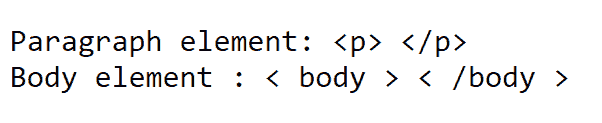
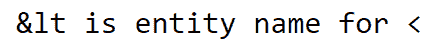

# 如何在 HTML 中将 HTML 标签显示为纯文本？

> 原文：[https://www.geeksforgeeks.org/how-to-display-html-tags-as-plain-text-in-html/](https://www.geeksforgeeks.org/how-to-display-html-tags-as-plain-text-in-html/)

基本上，有两种方法可以将 HTML 标记显示为纯文本。

**1. 使用`<plaintext>`元素：**`<plaintext>`元素不推荐使用，这意味着不再支持该功能。虽然某些浏览器可能仍然支持它，但不建议使用。

**2. HTML 实体：**第二个也是唯一可用的选项是使用 HTML 实体。`<`、`>`是 HTML 中的保留字符，为了显示这些保留字符，您必须用 HTML 实体替换它们。您可以在这里了解更多关于实体[的信息。您可以使用实体名称或实体编号，以 `&` 初始化，以 `;` 结束](https://www.geeksforgeeks.org/html-entities/)。

所需 HTML 实体见下表：

| 符号 | 描述 | 实体名称 | 实体编号 |
| :--- | :--- | :--- | :--- |
| `<` | 小于（HTML 元素的开始） | `&lt;` | `&#60;` |
| `>` | 大于（HTML 元素的结束） | `&gt;` | `&#62;` |
| `"` | 双引号 | `&quot;` | `&#34;` |
| `&` | 和号（HTML 实体的开始） | `&amp;` | `&#38;` |

**示例 1：** 在第一个示例中，我们使用 HTML 实体名称在网页上显示 `<body>` 元素和 `<p>` 段落元素。

## HTML

```html
<!DOCTYPE html>
<html>

<head>
    <title>Plain text </title>
</head>

<body>
    <pre>
        Paragraph element: <p> </p>
        Body element : <body> </body>
    </pre>
</body>

</html>
```

**输出：**



输出

**说明：** 在上面的代码中，`<`、`>`只是被它们各自的 HTML 实体所代替。`<pre></pre>`是定义预格式化文本的 HTML 元素。

**示例 2：** 在下面的示例中，我们试图使用`&`符号的实体名称来显示`<`的 HTML 实体名称。

## HTML

```html
<!DOCTYPE html>
<html lang="en">

<head>
    <title>Plain text demo</title>
</head>

<body>
    <pre>
        &lt; is entity name for <
    </pre>
</body>

</html>
```

**输出：**



输出

**说明：** 上例中`&`替换为`&amp;`，`<`替换为`&lt;`。