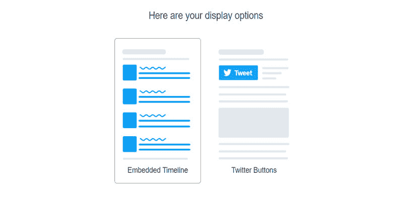
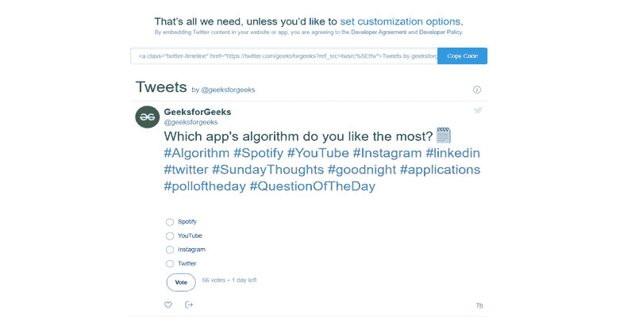

# 如何使用 HTML 显示推特账号的最新推文？

> 原文：[https://www.geeksforgeeks.org/how-to-display-latest-tweets-from-a-twitter-account-using-html/](https://www.geeksforgeeks.org/how-to-display-latest-tweets-from-a-twitter-account-using-html/)

在本文中，我们将看到如何使用 HTML 在我们的网页上显示任何用户的推文。

推特是最受欢迎的社交媒体平台之一。这是一项美国社交网络服务，用户可以在上面发布被称为“推文”的消息并与之互动。只有注册用户可以发推、喜欢和转发他人的推文，但未注册用户也可以阅读那些公开的推文。每个人都想在他们的博客网站上显示他们的推文。所以，在这篇文章中，我们将讨论如何借助 [HTML](https://www.geeksforgeeks.org/html-tutorials/) 以最简单的方式在我们的网站上显示某人的推文。

## 方法
下面是分步实施。

## 第一步
访问 `https://publish.twitter.com/`。

*   输入您想向其显示推文的个人资料链接。例如 `https://twitter.com/geeksforgeeks`。


## 第二步
之后，这里会弹出一个新页面。点击 **嵌入时间轴**。



## 第三步
然后你会得到你的 HTML 代码和账号推文的预览。复制 HTML 代码。



*   它看起来和下面的代码一样，但是 `href` 值会有变化。
*   您也可以使用此代码并将 `href` 值更改为您的个人资料帐户 URL。

**语法：**

```html
<a class="twitter-timeline" 
    href="https://twitter.com/geeksforgeeks?ref_src=twsrc%5Etfw">
    <!-- In your code value of href tag will be changed -->
    Tweets by Geeksforgeeks
</a>

<script async src=
"https://platform.twitter.com/widgets.js" charset="utf-8">
</script>

<!-- It's a javascript file which will perform 
all actions which we need to show tweets-->
```

## 第四步
把上面的代码添加到你想要显示推文的 HTML 文件中，并添加一些 CSS，让它看起来更加美观方便。

**示例：**

```html
<!DOCTYPE html>
<html>
  <head>
    <title>Tweets</title>
  </head>
  <body>
    <a class="twitter-timeline" href=
       "https://twitter.com/geeksforgeeks?ref_src=twsrc%5Etfw">
      <!-- In your code value of href tag will be changed -->
      Tweets by Geeksforgeeks
    </a>

    <script async src=
    "https://platform.twitter.com/widgets.js" charset="utf-8">
    </script>
    <!-- It's a javascript file which will perform all 
          actions which we need to show tweets-->
  </body>
</html>
```

**输出：**

