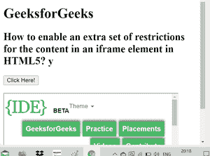

# 如何在 HTML5 中为 iframe 元素中的内容启用额外的限制集？

> 原文: [https://www.geeksforgeeks.org/how-to-enable-extra-set-of-restrictions-for-content-in-an-iframe-element-in-html5/](https://www.geeksforgeeks.org/how-to-enable-extra-set-of-restrictions-for-content-in-an-iframe-element-in-html5/)

## 方法

本文的方法是学习如何在 HTML5 中为 `iframe` 元素中的内容启用一组额外的限制。可以使用 `<iframe>` 元素的 `sandbox` 属性来完成任务。该属性用于允许对 `iframe` 中的内容附加一组限制。

`sandbox` 属性的值要么是简单的沙盒（然后应用所有限制），要么是一个用空格分隔的预定义值列表，它将带走实际的限制。

以下是 `sandbox` 属性具有的预定义值列表：

*   **无值:** 适用所有限制。
*   `allow-forms`: 重新启用表单提交。
*   `allow-pointer-lock`: 重新启用应用编程接口。
*   `allow-popups`: 重新启用弹出。
*   `allow-same-origin`: 允许将 `iframe` 的内容视为同源。
*   `allow-scripts`: 重新启用脚本。
*   `allow-top-navigation`: 允许 `iframe` 的内容导航其顶级浏览上下文。

## 语法

```html
<iframe sandbox="value">
```

## 示例

### 超文本标记语言

```html
<!DOCTYPE html>
<html>

<body>
    <h1>GeeksforGeeks</h1>

    <h2>
        How to enable an extra set of
        restrictions for the content in
        an iframe element in HTML5?
    </h2>

    <button onclick="myGeeks()">
        Click Here!
    </button>
    <br><br>

    <iframe id="GFGFrame" src=
        "https://ide.geeksforgeeks.org/tryit.php" 
        width="400" height="200" sandbox>
    </iframe>
</body>

</html>
```

## 输出

