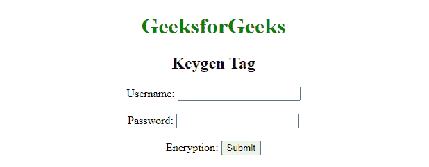

# 如何在HTML中生成公钥？

> 原文：`https://www.geeksforgeeks.org/how-to-generate-public-key-in-html/`

您可以使用HTML中的 [`<keygen>`](https://www.geeksforgeeks.org/html-keygen-tag/) 标签轻松生成公钥。`<keygen>` 元素生成加密密钥，用于将加密数据传递给服务器。`<keygen>` 元素的目的是提供一种安全的方法来验证用户。

实际上，当提交表单时，会生成两个密钥，私钥和公钥。私钥存储在本地，公钥发送到服务器。公钥用于生成客户端证书，以便将来验证用户。

## 语法

```html
<keygen name="name" challenge="challenge" 
    keytype="type" keyparams="pqg-params">
```

## 属性值

*   `name`：指定与表单数据一起提交的 `keygen` 元素的名称。
*   `keytype`：指定要生成的密钥类型。值为 `RSA`、`DSA` 和 `EC`，默认情况下为 `RSA`。
*   `challenge`：与公钥一起提交的挑战字符串。如果未指定，则默认为空字符串。
*   `keyparams`：指定 `keygen` 元素所关联的 `<form>` 元素。

## 注意

`keyparams` 属性是生成 `DSA` 和 `EC` 密钥所必需的。

## 示例

### 超文本标记语言

```html
<!DOCTYPE html>
<html>

<body>
    <center>
        <h1 style="color:green;">
            GeeksforGeeks
        </h1>

<h2>Keygen Tag</h2>

<form>
            <label>Username:
                <input type="text" name="username"></label>
            </br>
            <label>Password:
                <input type="password" name="password"></label>
            </br>
            <label>Encryption: <keygen name="key"></label>
            <input type="submit" value="Submit">
        </form>
    </center>
</body>

</html>
```

## 输出



`keygen` 标签