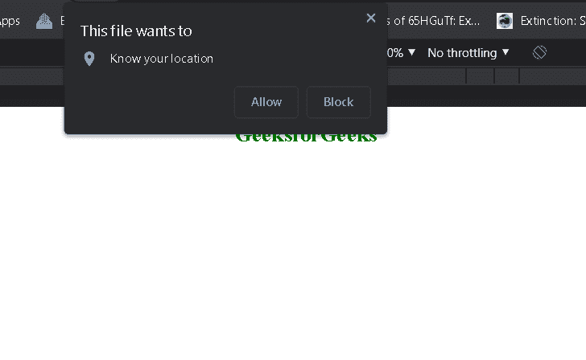
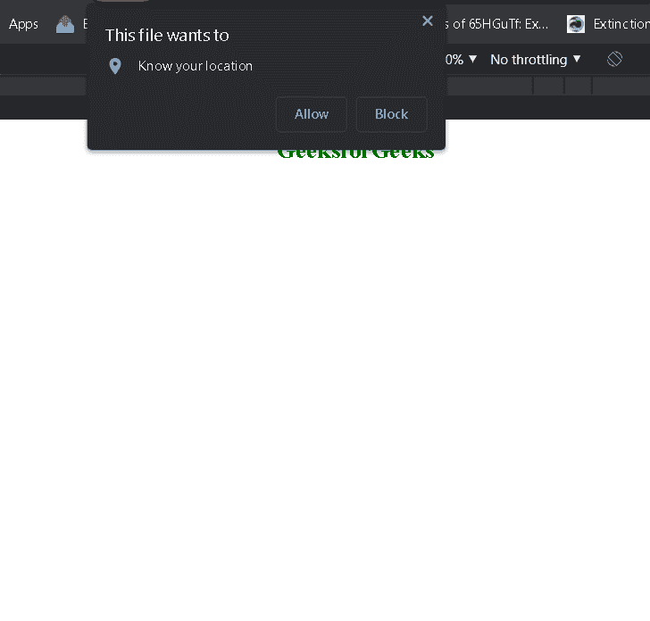

# 如何在HTML5中获取用户的地理位置？

> 原文：[https://www.geeksforgeeks.org/how-to-get-geographic-position-of-a-user-in-html5/](https://www.geeksforgeeks.org/how-to-get-geographic-position-of-a-user-in-html5/)

## 简介
在本文中，我们将看到如何在HTML5中获取用户的地理位置。

## 方法
在HTML5中获取用户的地理位置，我们使用[地理定位API](https://www.geeksforgeeks.org/html-geolocation/)。HTML5中的地理位置用于在用户允许的情况下与某些网站共享用户的位置。它使用JavaScript获取经纬度。大多数浏览器都支持地理定位应用编程接口。

## 语法
```
var location = navigator.geolocation.getCurrentLocation()
```
上述语法中的变量`location`具有以下属性：
*   `坐标纬度`：始终以十进制数返回纬度
*   `坐标精度`：始终返回位置精度
*   `坐标经度`：始终以十进制数返回经度
*   `坐标高度`：返回海拔高度（如果可用）
*   `坐标高度精度`：返回位置的高度精度（如果可用）
*   `坐标航向`：从北顺时针返回航向度数（如果可用）
*   `坐标速度`：返回主生产计划中的速度（如果可用）
*   `时间戳`：返回响应日期或时间（如果可用）

## 示例1
在本例中，我们将使用使用地理定位API创建的`Location`对象显示用户权限的经度和纬度。

### HTML
```html
<!DOCTYPE html>
<html>
<head>
    <title>Latitude and longitude</title>
</head>
<body>
    <center>
        <h1 class="gfg" style="color:green;">
            GeeksforGeeks
        </h1>
        <h2 id="Location"></h2>
    </center>
    <script>
        var Location = document.getElementById("Location");
        navigator.geolocation.getCurrentPosition(showLocation);
        function showLocation(position) {
            Location.innerHTML =
                "Latitude: " + position.coords.latitude +
                "<br>Longitude: " + position.coords.longitude;
        }
    </script>
</body>
</html>
```

### 输出


## 示例2
在本例中，我们使用地图框，使用我们到达的经纬度来显示用户在地图上的位置。以下是创建谷歌地图框的步骤：

**第一步**：在HTML页面中添加以下脚本，启用`google`地图框功能。
```html
<script src="https://maps.google.com/maps/api/js?sensor=false"></script>
```

**步骤2**：使用以下命令创建具有经度和纬度坐标的网格对象：
```html
var lattlong = new google.maps.LatLng(latitude, longitude);
```

**步骤3**：使用以下代码创建地图框，以用户在`div`中的位置为中心，id为`Map`：
```html
var Mapmain = new google.maps.Map(document.getElementById("Map"));
```

下面是上述方法的实现。

### HTML
```html
<!DOCTYPE html>
<html>
<head>
    <title>Latitude and longitude</title>
    <script src="https://maps.google.com/maps/api/js?sensor=false"></script>
</head>
<body>
    <center>
        <h1 style="color:green;">
            GeeksforGeeks
        </h1>
        <div id="Map" style="width:700px; height:500px"></div>
    </center>
    <script>
        var Location = document.getElementById("Location");
        navigator.geolocation.getCurrentPosition(showLocation);
        function showLocation(position) {
            latt = position.coords.latitude;
            long = position.coords.longitude;
            var lattlong = new google.maps.LatLng(latt, long);
            var Options = {
                center: lattlong,
                zoom: 15,
                mapTypeControl: true,
                navigationControlOptions:
                    { style: google.maps.NavigationControlStyle.SMALL }
            }
            var Mapmain = new google.maps.Map(document.getElementById("Map"), Options);
            var markerpos = new google.maps.Marker({ position: lattlong, map: Mapmain });
        }
    </script>
</body>
</html>
```

### 输出
