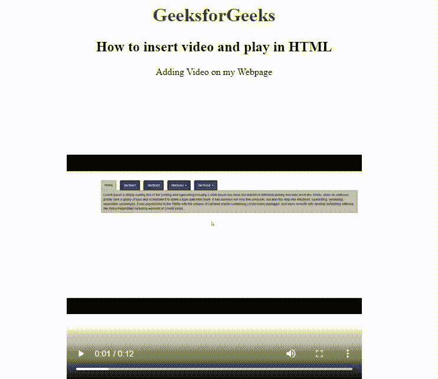

# 如何在网页中插入视频，并使用 HTML 进行播放？

> 原文：[https://www.geeksforgeeks.org/how-to-insert-video-in-web-page-and-play-it-using-html/](https://www.geeksforgeeks.org/how-to-insert-video-in-web-page-and-play-it-using-html/)

HTML 允许使用 [`<video>` 标签](https://www.geeksforgeeks.org/html5-video/)在网页浏览器中播放视频。为了在网页中嵌入视频，我们使用 `src` 元素来表示文件地址，并使用 `width` 和 `height` 属性来定义其大小。

**示例：** 在本例中，我们使用 `<video>` 标签向网页中添加视频。视频标签使用 `width`、`height` 和 `controls` 属性来设置网页上视频的大小和控件。另外，使用带有 `src` 属性的 `<source>` 标签来添加视频源。

```html
<!DOCTYPE html> 
<html>

<body style="text-align: center;">

<h1 style="color: green;">
        GeeksforGeeks
    </h1>

<h2> 
        How to insert video 
        and play in HTML
    </h2>

<p> 
        Adding Video on my Webpage 
    <p>

<video width="500px" height="500px" 
        controls="controls"/>

<source src="vid.mp4" 
            type="video/mp4"> 
    </video> 
</body>

</html> 
```

**输出：**
