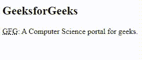
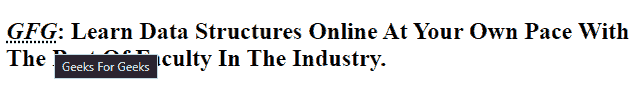

# 如何在 HTML 中标记缩写并使其易于理解？

> 原文：[https://www.geeksforgeeks.org/how-to-mark-abbreviations-and-make-them-understandable-in-html/](https://www.geeksforgeeks.org/how-to-mark-abbreviations-and-make-them-understandable-in-html/)

在本文中，我们将学习如何在 HTML 中指定内容的较短版本。`<abbr>` 标记（缩写）用于定义元素的缩写或简称。`<acronym>` 标记用作缩写版本，用于表示一系列字母。例如，“超文本标记语言”是“超文本标记语言”的缩写。

## 语法

```html
<abbr title ="text">Abbreviated form</abbr>
```

## 属性

该标签接受如下描述的可选属性：

*   `title`：它用于指定元素的额外信息。当鼠标在元素上移动时，它显示信息。

## 示例

这个示例说明了在 HTML 中使用 `<abbr>` 标签。

### HTML

```html
<!DOCTYPE html>
<html>

<head>
    <title>abbr tag</title>
</head>

<body>
    <h2>Welcome to <abbr 
        title="GeekforGeeks">GFG</abbr>
    </h2>
</body>

</html>
```

### 输出


使用 `<abbr>` 标签根本不会显示缩写的扩展，即使鼠标悬停在上面。这使得用户很难理解缩写形式。

有两种方法可以让缩写变得容易理解：

*   使用带有 `title` 属性的 `<abbr>`
*   使用 `<abbr>` 和 `<dfn>`

我们将通过例子来理解这两种方式。

### `<abbr>` 带 `title` 属性

为了消除这个问题，`<abbr>` 标记与 `title` 属性结合使用，为缩写提供了扩展。当鼠标指针悬停在元素上时，浏览器会将此文本作为工具提示提供。

#### 语法

```html
<abbr title="expanded form"> abbreviated form </abbr>
```

#### 示例

在本例中，我们在 `<abbr>` 标签中使用了 `title` 属性，该属性指定了关于元素的额外信息。

##### HTML

```html
<!DOCTYPE html>
<html>

<head>
    <title>abbr tag</title>
</head>

<body>
    <h2>GeeksforGeeks</h2>

    <p>
        <abbr title="GeekforGeeks">GFG</abbr>:
        A Computer Science portal for geeks.
    </p>
</body>

</html>
```

##### 输出



### `<abbr>` 与 `<dfn>`

`<abbr>` 可以与 `<dfn>` 一起使用，为缩写添加定义。

#### 语法

```html
<dfn> <abbr title="Expanded form"> Abbreviated form </abbr> </dfn>
```

#### 示例

此示例说明了在 HTML 中使用带有 `<dfn>` 标记的 `<abbr>` 标记。

##### HTML

```html
<!DOCTYPE html>
<html>

<head>
    <title>abbr with dfn</title>
</head>

<body>
    <h2>
        <dfn> <abbr title="Geeks For Geeks">
            GFG</abbr>
        </dfn>
        : Learn Data Structures Online At 
        Your Own Pace With The Best Of Faculty
        In The Industry.
    </h2>
</body>

</html>
```

##### 输出



这些是我们可以用来标记缩写的方法，让用户可以理解它们。