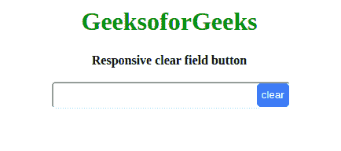
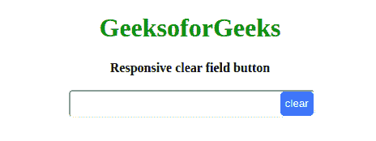

# 如何在HTML输入文本字段内放置一个响应清晰的按钮？

> 原文：[https://www.geeksforgeeks.org/how-to-put-a-responsive-clear-button-inside-html-input-text-field/](https://www.geeksforgeeks.org/how-to-put-a-responsive-clear-button-inside-html-input-text-field/)



输入字段内的响应按钮将清除点击事件上的文本区域。在本文中，我们将讨论如何使用HTML、CSS和JavaScript在HTML输入字段中放置一个响应明确的按钮。为了将按钮放在输入字段中，我们将使用CSS。让我们先看看HTML。

## 创建结构
在本节中，我们将为输入字段创建基本结构。

### HTML代码
通过使用HTML，我们将输入字段放置在我们将添加响应按钮来清除字段的地方。我们创建一个**文本字段**和一个**按钮**，并将它们放置在**同一个分区**中。为了使按钮适合输入文本字段，需要以下CSS。

```html
<!DOCTYPE html>
<html lang="en">

<head>
    <meta charset="UTF-8">
    <meta name="viewport" 
          content="width=device-width, initial-scale=1.0">
    <title>Responsive clear field button</title>
</head>

<body>
    <h1>GeeksoforGeeks</h1>
    <b>Responsive clear field button</b>
    <br><br>
    <div class="buttonIn">
        <input type="text" id="enter">
        <button id="clear">clear</button>
    </div>
</body>

</html>
```

## 设计结构
在本节中，我们将设计结构，使其具有吸引力或意义。

### CSS代码
将父师的`position`属性设置为`relative`。将按钮的`position`设置为分部内的`absolute`。以上两个动作使我们可以将按钮移动到`div`的**右上角位置**，这将在输入字段中移动按钮并将其放在右端。为此，我们将`top`和`right`边距设置为`0px`，但是该值可以根据设计要求而变化。我们放置一个大于1的`z-index`来定位输入字段上方的层的按钮。

```html
<style>
    h1 {
        color: green;
    }

    .buttonIn {
        width: 300px;
        position: relative;
    }

    input {
        margin: 0px;
        padding: 0px;
        width: 100%;
        outline: none;
        height: 30px;
        border-radius: 5px;
    }

    button {
        position: absolute;
        top: 0;
        border-radius: 5px;
        right: 0px;
        z-index: 2;
        border: none;
        top: 2px;
        height: 30px;
        cursor: pointer;
        color: white;
        background-color: #1e90ff;
        transform: translateX(2px);
    }

</style>
```

## 响应结构
在本节中，我们可以使用下面的任何代码部分，通过使用普通的JavaScript使其响应，或者我们也可以为此使用jQuery。在下面两种方法中，基本方法是相同的。我们监听按钮上的点击事件，一旦它被触发，我们就将输入字段的值设置为空字符串。

### JavaScript代码
使清除按钮响应的JavaScript代码。

```html
<script>
    window.addEventListener('load', () => {
        const button = document.querySelector('#clear');
        button.addEventListener('click', () => {
            document.querySelector('#enter').value = "";
        });
    }); 
</script>
```

### jQuery代码

```html
$(document).ready(()=>
        {
            alert("nigge")
            $('#clear').on('click', () =>
            {
                $('#enter').val("");
            })
        });
```

## 最终解决方案
在本节中，我们将把所有部分结合在一起，但是如果您想通过使用jQuery部分来实现任务，则必须使用CDN链接。

### CDN jQuery链接

### 节目

```html
<!DOCTYPE html>
<html lang="en">

<head>
    <meta charset="UTF-8">
    <meta name="viewport" 
          content="width=device-width, initial-scale=1.0">
    <title>Responsive clear field button</title>
    <style>
        h1 {
            color: green;
        }
        .buttonIn {
            width: 300px;
            position: relative;
        }

        input {
            margin: 0px;
            padding: 0px;
            width: 100%;
            outline: none;
            height: 30px;
            border-radius: 5px;
        }

        button {
            position: absolute;
            top: 0;
            border-radius: 5px;
            right: 0px;
            z-index: 2;
            border: none;
            top: 2px;
            height: 30px;
            cursor: pointer;
            color: white;
            background-color: #1e90ff;
            transform: translateX(2px);
        }
    </style>
</head>

<body>
<center>
    <h1>GeeksoforGeeks</h1>
    <b>Responsive clear field button</b>
    <br>
    <br>
    <div class="buttonIn">
        <input type="text" id="enter">
        <button id="clear">clear</button>
    </div>
<center>
    <script>
    window.addEventListener('load', () => {
        const button = document.querySelector('#clear');
        button.addEventListener('click', () => {
            document.querySelector('#enter').value = "";
        });
    }); 
   </script>
</body>

</html>
```

### 输出



CSS是网页的基础，通过设计网站和网络应用程序用于网页开发。你可以通过以下[CSS教程](https://www.geeksforgeeks.org/css-tutorials/)和[CSS示例](https://www.geeksforgeeks.org/css-examples/)从头开始学习CSS。

jQuery是一个开源的JavaScript库，它简化了HTML/CSS文档之间的交互，它以其“少写多做”的理念而闻名。
跟随本[jQuery教程](https://www.geeksforgeeks.org/jquery-tutorials/)和[jQuery示例](https://www.geeksforgeeks.org/jquery-examples/)可以从头开始学习jQuery。