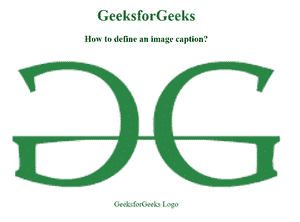

# 如何使用 HTML 为图像设置标题？

> 原文：[https://www.geeksforgeeks.org/how-to-set-caption-for-an-image-using-html/](https://www.geeksforgeeks.org/how-to-set-caption-for-an-image-using-html/)

HTML 中的`<figcaption>`标记用于为文档中的图形元素设置标题。这个标签在 HTML5 中是新的。

**语法：**

```html
<figcaption> Figure caption... </figcaption>
```

**例 1：**

下面是一个使用`<figure>`和`<figcaption>`为图像添加标题的完整示例。

```html
<!DOCTYPE html>
<html>
<head>
    <style>
        body {
            text-align: center;
        }
        h1 {
            color: green;
        }
    </style>
</head>
<body>
    <h1>GeeksforGeeks</h1>
    <h3>
        How to define an image caption?
    </h3>
    <figure>
        
        <figcaption>GeeksforGeeks Logo</figcaption>
    </figure>
</body>
</html>
```

**输出：**

