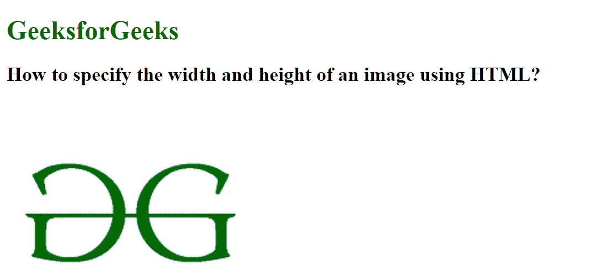
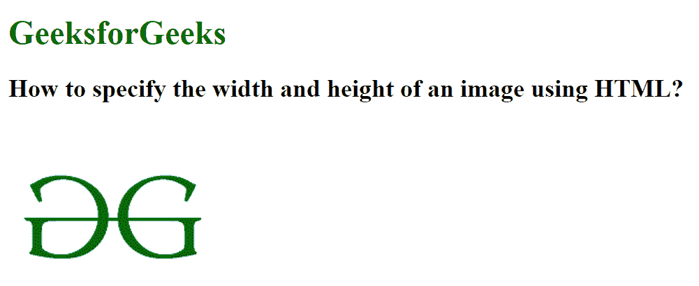

# 如何使用 HTML 设置图像的宽度和高度？

> 原文：[https://www.geeksforgeeks.org/how-to-set-the-width-and-height-of-an-image-using-html/](https://www.geeksforgeeks.org/how-to-set-the-width-and-height-of-an-image-using-html/)

可以使用 `height` 和 `width` 属性设置图像的高度和宽度。高度和宽度可以用像素来设定。

`` `height` 属性用于以像素为单位设置图像的高度。`` `width` 属性用于以像素为单位设置图像的宽度。

### 示例 1
在本例中，我们将设置图像的宽度和高度。

```html
<!DOCTYPE html>
<html>

<head>
    <title>
        How to specify the width and
        height of an image using HTML?
    </title>
</head>

<body>
    <h1 style="color:green;">GeeksforGeeks</h1>

    <h2>
        How to specify the width and
        height of an image using HTML?
    </h2>

    
</body>

</html>
```

**输出：**



### 示例 2
在本例中，我们将不分配宽度和高度值，因此图像将以其原始高度和宽度显示。

```html
<!DOCTYPE html>
<html>

<head>
    <title>
        How to specify the width and
        height of an image using HTML?
    </title>
</head>

<body>
    <h1 style="color:green;">GeeksforGeeks</h1>

    <h2>
        How to specify the width and
        height of an image using HTML?
    </h2>

    
</body>

</html>
```

**输出：**

