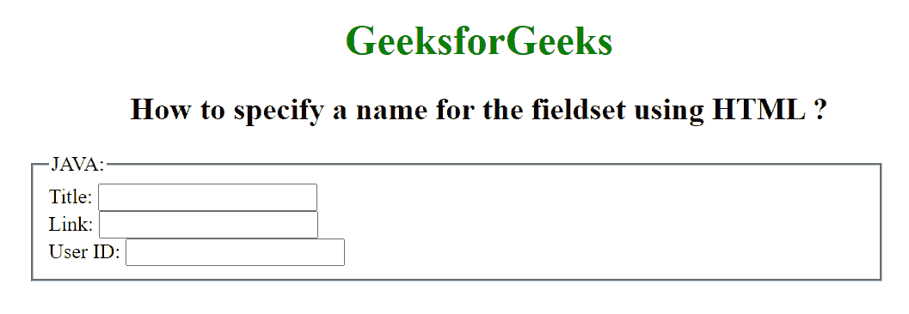

# 如何使用 HTML 为字段集指定名称？

> 原文：[https://www.geeksforgeeks.org/how-to-specify-a-name-for-the-fieldset-using-html/](https://www.geeksforgeeks.org/how-to-specify-a-name-for-the-fieldset-using-html/)

HTML5 中的`<fieldset>`标签用于在表单中创建一组相关的元素，并在元素上创建框。

`<fieldset>`标签在 HTML5 中是新的。

HTML `fieldset` `name`属性用于指定`fieldset`元素的名称。它用于在提交表单后引用表单数据，或者引用 JavaScript 中的元素。

**语法：**
```html
<fieldset name="text">
```

**属性值：**包含属性值`name`，指定`fieldset`元素的名称。

### 示例

```html
<!DOCTYPE html>
<html>

<head>
    <title>
        How to specify a name for
        the fieldset using HTML ?
    </title>

    <style>
        h1,
        h2 {
            text-align: center;
        }

        h1 {
            color: green;
        }

        fieldset {
            width: 50%;
            margin-left: 22.5%;
        }
    </style>
</head>

<body>
    <h1>GeeksforGeeks</h1>

    <h2>
        How to specify a name for
        the fieldset using HTML ?
    </h2>

    <form id="myGeeks">
        <fieldset id="GFG" name="Geek_field">
            <legend>JAVA:</legend>
            Title:
            <input type="text">
            <br> Link:
            <input type="text">
            <br> User ID:
            <input type="text">
        </fieldset>
    </form>
</body>

</html>
```

**输出：**



**支持的浏览器：**

*   谷歌 Chrome
*   火狐浏览器
*   歌剧
*   苹果 Safari