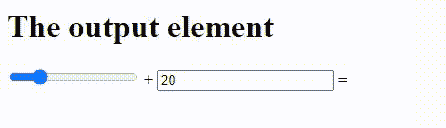

# 如何在 HTML 中为输出元素指定名称？

> 原文：[https://www.geeksforgeeks.org/how-to-specify-a-name-for-the-output-element-in-html/](https://www.geeksforgeeks.org/how-to-specify-a-name-for-the-output-element-in-html/)

`name` 属性指定一个 `<output>` 元素的名称。它用于在表单数据提交后引用表单数据，或者在 JavaScript 中引用元素。`<output>` 标记用于表示计算结果。

使用 `type` 属性的 HTML `<strong>`，因为它指定了计算结果和计算中使用的元素之间的关系。`form` 被使用是因为它指定了它属于哪个表单的输出元素。之所以使用 `name`，是因为它指定了输出元素的名称。

**语法：**

```html
<output name="name">
```

**示例：**

## HTML

```html
<!DOCTYPE html>
<html>
    <body>

<h1>The output element</h1>

<form oninput="k.value=parseInt(x.value)+parseInt(y.value)">
          <input type="range" id="x" value="20"> + 
          <input type="number" id="y" value="20">
          = <output name="k" for="x y"></output>
        </form>
    </body>
</html>
```

**输出：**

