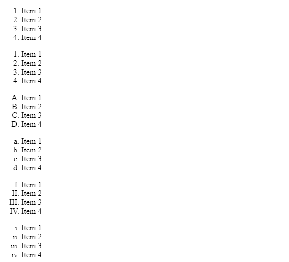
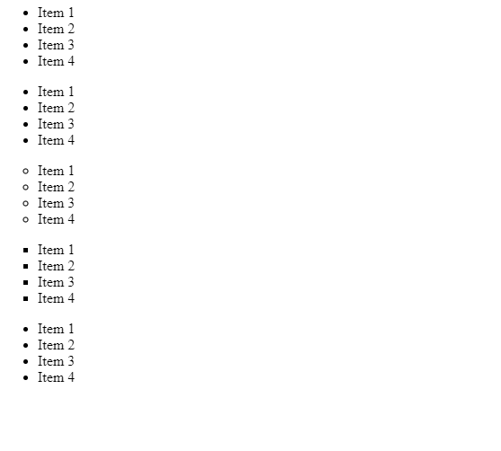

# 如何在 HTML5 中指定列表中要使用的标记种类？

> 原文：[https://www.geeksforgeeks.org/how-to-specify-the-kind-of-marker-to-be-used-in-the-list-in-html5/](https://www.geeksforgeeks.org/how-to-specify-the-kind-of-marker-to-be-used-in-the-list-in-html5/)

HTML 中有两种类型的列表，第一种是使用 `<ol>` 标签创建的有序列表，第二种是使用 `<ul>` 标签创建的无序列表。这两个列表都应该有一个 `<li>` 标签来表示其中的数据。

有序列表以可计数的形式表示数据。这里的标记是数字。例如：

1.  项目 1
2.  项目 2
3.  项目 3

无序列表以不可数的形式表示数据。这里的标记是一个圆盘。例如：

*   项目 1
*   项目 2
*   项目 3

本文的目的是向您展示如何在不使用 CSS 的情况下更改标记。

## 有序列表标记

有序列表中有五种类型的标记，标记是使用 `type` 属性指定的。

**语法：**

```html
<ol type="Enter type of list"></ol>
```

**列表项类型：** [HTML `ol` `type` 属性。](https://www.geeksforgeeks.org/html-ol-type-attribute/)

| **Type** | **Description** |
| --- | --- |
| `type="1"` | 列表编号 **（默认）** |
| `type="A"` | 列表以大写字母编号。 |
| `type="a"` | 列表以小写字母编号。 |
| `type="I"` | 列表以大写罗马数字编号。 |
| `type="i"` | 列表以小写罗马数字编号。 |

### 例 1：实现有序列表属性

```html
<!DOCTYPE html>
<html>

<body>
  <ol>
    <li>Item 1</li>
    <li>Item 2</li>
    <li>Item 3</li>
    <li>Item 4</li>
  </ol>
  <ol type="1">
    <li>Item 1</li>
    <li>Item 2</li>
    <li>Item 3</li>
    <li>Item 4</li>
  </ol>
  <ol type="A">
    <li>Item 1</li>
    <li>Item 2</li>
    <li>Item 3</li>
    <li>Item 4</li>
  </ol>
  <ol type="a">
    <li>Item 1</li>
    <li>Item 2</li>
    <li>Item 3</li>
    <li>Item 4</li>
  </ol>
  <ol type="I">
    <li>Item 1</li>
    <li>Item 2</li>
    <li>Item 3</li>
    <li>Item 4</li>
  </ol>
  <ol type="i">
    <li>Item 1</li>
    <li>Item 2</li>
    <li>Item 3</li>
    <li>Item 4</li>
  </ol>
</body>

</html>
```

**输出：**



## 无序列表标记

无序列表中有三种类型的标记，标记是使用 `type` 属性指定的。

**语法：**

```html
<ul type="Enter type of list"></ul>
```

**列表项类型：** [HTML `ul` `type` 属性](https://www.geeksforgeeks.org/html-ul-type-attribute/)。

| **Type** | **Description** |
| --- | --- |
| `type="disc"` | 用于显示实心圆 **（默认）** |
| `type="circle"` | 用于显示空心圆。 |
| `type="square"` | 用于显示方块。 |

### 示例 2：实现无序列表属性

```html
<!DOCTYPE html>
<html>

<body>
  <ul>
    <li>Item 1</li>
    <li>Item 2</li>
    <li>Item 3</li>
    <li>Item 4</li>
  </ul>
  <ul type="disc">
    <li>Item 1</li>
    <li>Item 2</li>
    <li>Item 3</li>
    <li>Item 4</li>
  </ul>
  <ul type="circle">
    <li>Item 1</li>
    <li>Item 2</li>
    <li>Item 3</li>
    <li>Item 4</li>
  </ul>
  <ul type="square">
    <li>Item 1</li>
    <li>Item 2</li>
    <li>Item 3</li>
    <li>Item 4</li>
  </ul>
  <ul type="triangle">
    <li>Item 1</li>
    <li>Item 2</li>
    <li>Item 3</li>
    <li>Item 4</li>
  </ul>
</body>

</html>
```

**输出：**



**注意：** 这里的 `triangle` 类型不被浏览器支持，这就是为什么它显示的是 `disc` 而不是三角形。