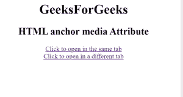

# HTML `<a>` 媒体属性

> 原文：[https://www.geeksforgeeks.org/html-a-media-attribute/](https://www.geeksforgeeks.org/html-a-media-attribute/)

**HTML `<a>` 媒体属性**指定链接文档优化的媒体或设备。此属性指定目标网址是为 iPhone、语音或打印媒体等设备设计的。这个属性可以接受几个值。仅当 `href` 属性存在时，才能使用此选项。

**可能的运算符：**

| value | describe |
| :--- | :--- |
| and | And 运算符 |
| not | Not 运算符 |
| , | Or 运算符 |

**设备：**

| value | describe |
| :--- | :--- |
| all | 适用于所有设备 |
| aural | 语音合成器 |
| braille | 盲文反馈设备 |
| handheld | 手持设备（小屏幕，有限带宽） |
| projection | 投影仪 |
| print | 打印预览模式/打印页面 |
| screen | 计算机屏幕 |
| tty | 电传打字机和类似媒体使用固定间距字符网格。 |
| tv | 电视 |

**数值：**

| numerical value | describe |
| :--- | :--- |
| width | 显示区域的宽度。 |
| height | 目标显示区域的高度。 |
| device-width | 目标设备或纸张的显示宽度。 |
| device-height | 目标设备或纸张的显示高度。 |
| orientation | 目标设备或纸张的显示方向。 |
| aspect-ratio | 目标显示区域的宽高比。 |
| device-aspect-ratio | 目标显示器/纸张的设备宽度/设备高度比率。 |
| color | 目标显示的每种颜色的位数。 |
| color-index | 目标显示可以处理的颜色数量。 |
| monochrome | 单色帧缓冲区中每个像素的位数。 |
| resolution | 目标/纸张的分辨率（dpi 或 dpcm）。 |
| scan | 电视的扫描方法。 |
| grid | 输出设备是网格还是位图。 |

**注意：** 可以使用 `"min-"` 和 `"max-"` 等前缀。

**例：**

## 代码示例

```html
<html>
<head>
    <title>
        HTML anchor media Attribute
    </title>
</head>
<body>
    <h1>GeeksForGeeks</h1>
    <h2>
    HTML anchor media Attribute
    </h2>
    <a href="https://ide.geeksforgeeks.org/"
    media="print and (resolution:300dpi)">
        Click to open in the same tab
    </a>
    <br>
    <a href="https://ide.geeksforgeeks.org/"
    target="_blank"
    media="print and (resolution:300dpi)">
        Click to open in a different tab
    </a>
</body>
</html>
```

**输出：**



**支持的浏览器：** HTML `<a>` 媒体属性支持的浏览器如下：

*   谷歌 Chrome
*   微软公司出品的 web 浏览器
*   火狐浏览器
*   苹果 Safari
*   歌剧