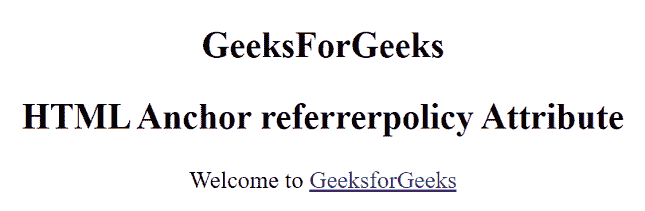

# HTML `<a>` referrerpolicy 属性

> 原文: [https://www.geeksforgeeks.org/html-a-referrerpolicy-attribute/](https://www.geeksforgeeks.org/html-a-referrerpolicy-attribute/)

HTML `<a>` `referrerpolicy` 属性用于指定当用户单击超链接时将发送到服务器的参考信息。

**语法:**

```html
<a referrerpolicy="no-referrer|no-referrer-when-downgrade|origin|
         origin-when-cross-origin|same-origin|
         strict-origin-when-cross-origin|unsafe-url">
```

**属性值:**

*   `no-referrer`: 指定不会随请求发送引用信息。
*   `no-referrer-when-downgrade`: 有默认值。它指定该引用头将不会发送到没有 HTTPS 的源。
*   `origin`: 指定在所有情况下只发送文档的来源作为推荐人。
*   `origin-when-cross-origin`: 执行同原点请求时发送原点、路径、查询字符串，其他情况只发送单据的原点。
*   `same-origin`: 指定将为同站点源发送推荐人，但跨源请求将不发送推荐人信息。
*   `strict-origin-when-cross-origin`: 执行同起源请求时发送起源、路径、查询字符串，执行跨起源请求时仅在协议安全级别不变时发送起源(HTTPS/HTTPS)，不发送报头到任何不太安全的目的地(HTTPS/HTTP)。
*   `unsafe-url`: 它发送一个源、路径和查询字符串作为一条参考信息，但不包括密码和用户名。

## 示例

```html
<!DOCTYPE html>
<html>

<head>
    <title>HTML a referrerpolicy Attribute</title>
</head>

<body>
   <h2>
    GeeksForGeeks
   </h2>
  <h2>
      HTML Anchor referrerpolicy Attribute
  </h2>
    <p>Welcome to
        <a rel="noopener"
           href="https://ide.geeksforgeeks.org/"
           referrerpolicy="no-referrer">
            GeeksforGeeks
        </a>
     </p>

</body>

</html>
```

**输出:**



**支持的浏览器:**

*   谷歌 Chrome
*   微软公司出品的 web 浏览器
*   火狐浏览器
*   旅行队
*   歌剧