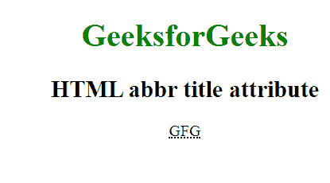

# HTML | abbr 标签的 `title` 属性

> 原文: [https://www.geeksforgeeks.org/html-abbr-title-attribute/](https://www.geeksforgeeks.org/html-abbr-title-attribute/)

HTML `<abbr>` 标签的 `title` 属性用于指定关于元素的额外信息。当鼠标悬停在元素上时，它会显示这些信息。

**语法:**
```html
<abbr title="text">
```

**属性值:** 该属性包含单值 `text`，用作元素的工具提示文本。`title` 属性与所有的 HTML 元素相关联。

**示例:**
```html
<!DOCTYPE html> 
<html> 
    <head> 
        <title>abbr tag</title> 
        <style> 
            body { 
                text-align:center; 
            } 
            h1 { 
                color:green; 
            } 
        </style> 
    </head> 
    <body>
        <center> 
        <h1>GeeksforGeeks</h1> 
        <h2>HTML abbr title attribute</h2> 
        <abbr title="GeeksforGeeks">GFG</abbr> 
    </center>
    </body> 
</html>
```

**输出:**


**支持的浏览器:** 下面列出了支持 HTML `<abbr>` 标签 `title` 属性的浏览器:
*   谷歌 Chrome
*   微软 Internet Explorer
*   火狐浏览器
*   Opera
*   Safari