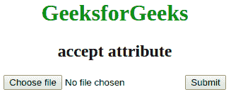

# HTML `accept` 属性

> 原文: [https://www.geeksforgeeks.org/html-accept-attribute/](https://www.geeksforgeeks.org/html-accept-attribute/)

此属性指定服务器接受的文件类型。该属性只能用于`<input>`元素。此属性不用于验证工具，因为文件上载应该在服务器上进行验证。

## 语法

```html
<input accept = "file_extension"> 
```

## 属性值

*   **文件扩展名:** 指定文件扩展名（如`.gif`，`.jpg`，`.png`，`.doc`）用户可以从中进行选择。
*   `audio/*`: 用户可以拾取所有声音文件。
*   `video/*`: 用户可以拾取所有视频文件。
*   `image/*`: 有效媒体类型，无参数。查看 IANA 媒体类型，了解标准媒体类型的完整列表。
*   **媒体类型**: 无参数的有效媒体类型。

## 属性

`accept`属性仅与`<input>`元素相关联。

## 示例

```html
<!DOCTYPE html>
<html>
    <head>
        <title>accept attribute</title>
        <style>
            body {
                text-align:center;
            }
            h1 {
                color:green;
            }
        </style>
    </head>
    <body>
        <h1>GeeksforGeeks</h1>
        <h2>accept attribute</h2>
        <form action=" ">
            <input type="file" name="picture" accept="image/*">
            <input type="submit">
        </form>
    </body>
</html>
```

## 输出



## 支持的浏览器

`accept`属性的支持的浏览器如下:

*   Google `Chrome` 8.0
*   `Internet Explorer` 10.0
*   `Firefox` 4.0
*   `Opera` 15.0
*   Apple `Safari` 6.0