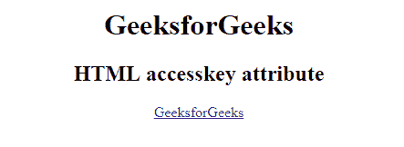
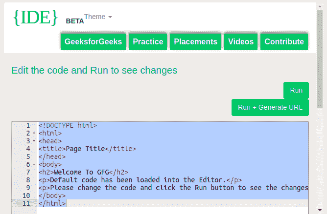

# HTML `accesskey` 属性

> 原文：[https://www.geeksforgeeks.org/html-accesskey-attribute/](https://www.geeksforgeeks.org/html-accesskey-attribute/)

HTML 中的 `accesskey` 属性是激活/聚焦特定元素的键盘快捷键。访问键属性依赖于浏览器。它可能因浏览器而异。

## 支持的标签

支持所有 HTML 元素。

## 语法

```html
<element accessKey = "single_character">
```

## 使用访问键的快捷方式

下表描述了使用访问键的快捷方式。

| 浏览器 | Windows 操作系统 | 苹果个人计算机 | Linux 操作系统 |
| :--- | :--- | :--- | :--- |
| 谷歌 Chrome | `Alt+single_character` | `Command+Alt+single_character` | `Alt+single_character` |
| Mozilla Firefox | `Alt+Shift+single_character` | `Alt+Shift+single_character` | `Alt+Shift+single_character` |
| 微软 Edge | `Alt+single_character` | 不适用 | 不适用 |
| Safari | `Command+Alt+single_character` | `Command+Alt+single_character` | 不适用 |
| Opera (13+) | `Alt+single_character` | `Command+Alt+single_character` | `Alt+single_character` |

**注:**

*   在 HTML4.1 中，`accesskey` 属性只能用于很少的元素。
*   在 HTML5 中，`accesskey` 属性可以用于任何元素。

当处理多个具有相同 `accesskey` 的元素时，浏览器的行为会有所不同：

*   **谷歌 Chrome 和 Safari:** 带有 `accesskey` 的最后一个元素将被激活。
*   **Opera:** 带有 `accesskey` 的第一个元素将被激活。
*   **Internet Explorer 和 Mozilla Firefox:** 下一个带有 `accesskey` 的元素将被激活。

## 示例

```html
<!DOCTYPE html>
<html>
    <head>
        <title>
            accesskey attribute
        </title>
    </head>

    <body style = "text-align:center">
        <h1>GeeksforGeeks</h1>

        <h2>HTML accesskey attribute</h2>

        <!-- The accesskey attribute used here -->
        <a href="https://ide.geeksforgeeks.org/tryit.php"
            accesskey = "g">GeeksforGeeks
        </a>
    </body>
</html>
```

## 输出

**使用访问键前:**



**使用访问键后:**



## 支持的浏览器

由 `accesskey` 属性支持的浏览器如下：

*   谷歌 Chrome
*   微软 Edge
*   火狐浏览器
*   Opera
*   Safari