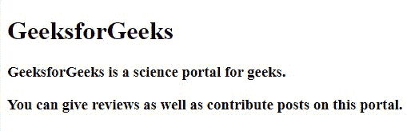

# HTML 块和内嵌元素

> 原文: [https://www.geeksforgeeks.org/html-block-and-inline-elements/](https://www.geeksforgeeks.org/html-block-and-inline-elements/)

在本文中，我们将了解 **HTML Block 元素 & Inline 元素**，并通过示例了解实现。呈现网页内容的每一个超文本标记语言文档都将依赖于元素类型，即块或内嵌，它们是默认显示值。我们将通过例子来理解这两个概念。

## 超文本标记语言

```html
<!DOCTYPE html>
<html>

<body>
    <div>GeeksforGeeks</div> 
    Checkout the GeeksforGeeks
    <a href="https://www.geeksforgeeks.org/" 
       alt="GeeksforGeeks">
      official</a> website for the articles on various courses. 
</body>

</html>
```

**输出:**


## 块和内嵌元素

在上面的例子中，我们使用了 `<div>` 标签，该标签总是从一个新的行开始，获取可用的全宽。我们已经使用了内联元素锚标签 `<a>` ，用于提供文本链接。内联元素不会在新的一行中开始，只捕获元素周围的空间。

### 块级元素

块级元素总是从新的一行开始，并尽可能向左和向右延伸，即它占据了其父元素的全部水平空间，高度等于内容的高度。

**支持的标签:**

*   HTML `<address>` 标签
*   HTML `<blockquote>` 标签
*   HTML `<dd>` 标签
*   HTML `<div>` 标签
*   HTML `<dl>` 标签
*   HTML `<dt>` 标签
*   HTML `<canvas>` 标签
*   HTML `<form>` 标签
*   HTML `<h1>` 到 `<h6>` 标签
*   HTML `<hr>` 标签
*   HTML `<li>` 标签
*   HTML `<main>` 标签
*   HTML `<nav>` 标签
*   HTML `<noscript>` 标签
*   HTML `<ol>` 标签
*   HTML `<pre>` 标签
*   HTML `<section>` 标签
*   HTML `<tfoot>` 标签
*   HTML `<ul>` 标签
*   HTML 表格
*   HTML 段落
*   HTML5 `<video>` 标签
*   HTML5 `<aside>` 标签
*   HTML5 `<article>` 标签
*   HTML5 `<figcaption>` 标签
*   HTML5 `<fieldset>` 标签
*   HTML5 `<figure>` 标签
*   HTML5 `<footer>` 标签
*   HTML5 `<header>` 标签

### div 元素

`<div>` 元素用作其他 HTML 元素的容器。它没有必需的属性。*style*、*class*、 *id* 是常用属性。

**语法:**

```html
<div>GFG</div>
```

**示例:**下面的代码说明了 `<div>` 标签的实现。

```html
<!DOCTYPE html>
<html>
<title>Block-level Element</title>

<body>
    <div>
        <h1>GeeksforGeeks</h1>
        <h3>GeeksforGeeks is a science portal for geeks.</h3>
        <h3>
          You can give reviews as well as
          contribute posts on this portal.
        </h3>
    </div>
</body>

</html>
```

**输出:**



### 内联元素

内联元素与块级元素相反。它不会从一个新的行开始，只占用必要的宽度，即它只占用定义 HTML 元素的标签所限定的空间，而不会破坏内容的流动。

**支持的标签:**

*   HTML `<br>` 标签
*   HTML `<button>` 标签
*   HTML `<time>` 标签
*   HTML `<tt>` 标签
*   HTML `<var>` 标签
*   HTML `<a>` 标签
*   HTML `<abbr>` 标签
*   HTML `<acronym>` 标签
*   HTML `<b>` 标签
*   HTML `<cite>` 标签
*   HTML `<code>` 标签
*   HTML `<dfn>` 标签
*   HTML `<em>` 标签
*   HTML `<i>` 标签
*   HTML `<output>` 标签
*   HTML `<q>` 标签
*   HTML `<samp>` 标签
*   HTML `<script>` 标签
*   HTML `<select>` 标签
*   HTML `<small>` 标签
*   HTML `<span>` 标签
*   HTML `<strong>` 标签
*   HTML `<sub>` 标签
*   HTML `<sup>` 标签
*   HTML `<textarea>` 标签
*   HTML `<bdo>` 标签
*   HTML `<big>` 标签
*   HTML `` 标签
*   HTML `<input>` 标签
*   HTML `<kbd>` 标签
*   HTML `<label>` 标签
*   HTML `<map>` 标签
*   HTML `<object>` 标签

### span 元素

`<span>` 标签用作文本的容器。它没有必需的属性。*style*、*class*、 *id* 是常用属性。

**语法:**

```html
<span>GFG</span>
```

**示例:**下面的代码说明了 `<span>` 标签的实现。

```html
<!DOCTYPE html>
<html>

<head>
    <style>
    body {
        text-align: center;
    }

h1 {
        color: green;
    }
    </style>
</head>
<body>
    <!-- Span element. -->
    <h1>Geeks
      <span style="color: red"> for</span>
      Geeks
    </h1> 
</body>

</html>
```

**输出:**


### 支持的浏览器

*   谷歌 Chrome 93.0
*   Mozilla Firefox 91.0
*   微软边缘 93.0
*   IE 11.0
*   Safari 14.1
*   Opera 78.0
