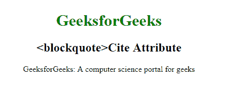

# HTML | blockquote cite attribute

> 原文: [https://www.geeksforgeeks.org/html-blockquote-cite-attribute/](https://www.geeksforgeeks.org/html-blockquote-cite-attribute/)

**HTML `<blockquote>` 引用属性**用于*指定引用的来源*。

**语法:**

```html
<blockquote cite="URL"> 
```

**属性值:**

*   **URL:** 包含指定报价来源的值即 **URL** 。
    *   **Possible Values:**
        *   **Absolute URL:** 指向另一个网站。
        *   **Relative URL:** 它指向网站内的一个文件。

**示例:**

```html
    <!DOCTYPE html>
    <html>

<head>
        <title>
          HTML 
          <blockquote>Cite Attribute 
      </title>
        <style>
            body {
                text-align: center;
            }

h1 {
                color: green;
            }
        </style>
    </head>

<body>
        <h1>GeeksforGeeks</h1>
        <h2><blockquote>Cite Attribute</h2>
        <blockquote cite="www.GeeksForGeeks.org.in">
          GeeksforGeeks: 
          A computer science portal for geeks
      </blockquote>
    </body>

</html>
    ```

**输出:**
    

**支持的浏览器:** 支持的浏览器包括:

*   谷歌 Chrome
*   微软公司出品的 web 浏览器
*   火狐浏览器
*   歌剧
*   旅行队
