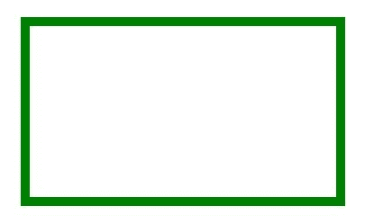
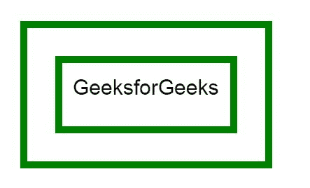

# HTML | 画布 rect() 方法

> 原文: [https://www.geeksforgeeks.org/html-canvas-rect-method/](https://www.geeksforgeeks.org/html-canvas-rect-method/)

HTML 中的 `rect()` 方法用来在 HTML 中创建一个矩形。

**语法:**

```html
context.rect(x, y, width, height)
```

**参数:**

*   **x:** 存储矩形左上角的 x 坐标。
*   **y:** 存储矩形左上角的 y 坐标。
*   **宽度:** 以像素为单位存储宽度。
*   **高度:** 以像素为单位存储高度。

**示例-1:**

```html
<!DOCTYPE html>
<html>

<head>
    <title>
        HTML canvas rect() Method
    </title>
</head>

<body>
    <canvas id="GFG" 
            width="500" 
            height="300">
  </canvas>

<script>
        var canvas = document.getElementById("GFG");
        var context = canvas.getContext("2d");

// Create rectangle
        context.rect(50, 50, 350, 200);
        context.strokeStyle = "green";
        context.lineWidth = "10";
        context.stroke();
    </script>

</body>

</html>
```

**输出:**


**示例-2:**

```html
<!DOCTYPE html>
<html>

<head>
    <title>
        HTML canvas rect() Method
    </title>
</head>

<body>
    <canvas id="GFG" 
            width="500" 
            height="300">
  </canvas>

<script>
        var canvas = document.getElementById("GFG");
        var context = canvas.getContext("2d");
        context.rect(50, 50, 350, 200);
        context.rect(100, 100, 250, 100);
        context.strokeStyle = "green";
        context.lineWidth = "10";
        context.font = "30px Arial";
        context.fillText("GeeksforGeeks", 120, 150);
        context.stroke();
    </script>
</body>

</html>
```

**输出:**


**支持的浏览器:**

*   谷歌 Chrome
*   Internet Explorer 9.0
*   火狐浏览器
*   旅行队
*   歌剧
