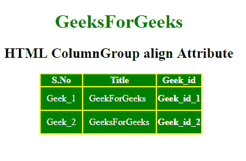

# HTML | colgroup 对齐属性

> 原文: [https://www.geeksforgeeks.org/html-colgroup-align-attribute/](https://www.geeksforgeeks.org/html-colgroup-align-attribute/)

**HTML `<colgroup>` 对齐属性**用于设置列组中文本或内容的水平对齐。

**语法:**

```html
<colgroup align="left|right|center|justify|char">
```

**属性值:**

*   **left:** 将内容设置为左对齐。
*   **right:** 将内容设置为右对齐。
*   **center:** 它将内容设置为居中。
*   **justify:** 拉长线条，平分内容。
*   **char:** 它将内容设置为特定的字符。

**示例:**

```html
<!DOCTYPE html> 
<html>

<head> 
    <title> 
        HTML ColumnGroup align Attribute 
    </title>

<style> 
        #myColGroup { 
            background: green; 
        }

table { 
            color: white; 
            margin-left: 180px; 
            background: yellow; 
        }

#Geek_p { 
            color: green; 
            font-size: 30px; 
        }

td { 
            padding: 10px; 
        } 
        h1, h2 {
            text-align:center;
        }
    </style> 
</head>

<body>

<h1> 
        GeeksForGeeks 
    </h1>

<h2> 
        HTML ColumnGroup align Attribute 
    </h2>

<table> 
        <colgroup id="myColGroup" span="3" align="left"> 
        </colgroup>

<tr> 
            <th>S.No</th> 
            <th>Title</th> 
            <th>Geek_id</th> 
        </tr> 
        <tr> 
            <td>Geek_1</td> 
            <td>GeekForGeeks</td> 
            <th>Geek_id_1</th> 
        </tr> 
        <tr> 
            <td>Geek_2</td> 
            <td>GeeksForGeeks</td> 
            <th>Geek_id_2</th> 
        </tr> 
    </table> 
</body>

</html>
```

**输出:**


**支持的浏览器:** 任何浏览器都不支持 `<colgroup>` align 属性。现在用 CSS 代替。
